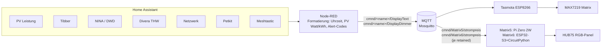

# IceMatrix - LED Matrix Displays mit Tasmota, ESP32, Raspberry Pi & Home Assistant

Steuerung mehrerer LED-Matrix-Displays über Tasmota, Node-RED und Home Assistant —
plus ein eigenständiges Raspberry-Pi-Projekt (Matrix5) mit HUB75-RGB-Panel.

> **Nicht verwechseln**: Matrix5 zeigt **Stromkosten/Waschzeitpunkt** (Tibber). Die
> ursprünglich hier gebaute TOTP/2FA-Anzeige ist komplett auf ein separates Projekt,
> [Kiosk2FA](https://github.com/icepaule/Ice-2FA-Kiosk), umgezogen (eigener Pi + Monitor,
> zeigt alle Accounts gleichzeitig statt nur 4 Slots wie früher auf Matrix5).

## Hardware

| Display | Module | Farbe | Controller | Funktion |
|---------|--------|-------|-----|----------|
| Matrix1 (PV-Matrix) | 4x MAX7219 (32x8) | Rot | ESP-12F | PV-Leistung (Sonnenstand-basiert) |
| Matrix2 | 4x MAX7219 (32x8) | Rot | ESP-12F | Uhrzeit + PV-Leistung |
| Matrix3 | 8x MAX7219 (64x8) | 4x Rot + 4x Blau | Wemos D1 Mini | Uhrzeit + PV + Alerts |
| Matrix4 (Strompreis) | 4x MAX7219 (32x8) | Rot | Wemos D1 Mini | Tibber Strompreis + Trend |
| **Matrix5 (Strompreis/Waschzeitpunkt)** | 1x HUB75 P4-2121-64x32-16S | RGB | **Raspberry Pi Zero 2W** | Aktueller Preis + günstigste Zeit (Tibber, Node-RED statt Tasmota) |
| **Matrix6 (Strompreis/Waschzeitpunkt, 2. Standort)** | 1x HUB75 P4-2121-64x32-16S | RGB | **ESP32-S3 + CircuitPython** | Identisch zu Matrix5, andere Hardware (kein Pi) |

Matrix5 und Matrix6 sind technisch komplett anders als Matrix1-4 (RGB-DMA-Panel statt serieller
MAX7219-Kette) und deshalb separat dokumentiert. Matrix6 zeigt exakt dieselbe Anzeige wie Matrix5,
läuft aber auf einem ESP32-S3 mit CircuitPython statt einem Raspberry Pi — die Doku dort ist
bewusst als wiederholbare Bauanleitung für weitere baugleiche Displays geschrieben:
→ [Matrix5: Stromkosten-/Waschzeitpunkt-Anzeige (Raspberry Pi)](docs/matrix5-strompreis.md)
→ [Matrix6: Stromkosten-/Waschzeitpunkt-Anzeige (ESP32-S3 + CircuitPython, Bauanleitung für MatrixN)](docs/matrix6-strompreis.md)

## Verkabelung (Matrix1-4, MAX7219)

### Wemos D1 Mini (Matrix3, Matrix4)

| MAX7219 Pin | Wemos D1 Mini Pin | GPIO |
|-------------|-------------------|------|
| CLK | D5 | GPIO14 |
| DIN (MOSI) | D7 | GPIO13 |
| CS | D3 | GPIO0 |
| VCC | 5V | - |
| GND | GND | - |

### ESP-12F (Matrix1, Matrix2) - andere Pinbelegung!

| MAX7219 Pin | ESP-12F Pin | GPIO |
|-------------|-------------|------|
| CLK | - | GPIO16 |
| DIN (MOSI) | - | GPIO4 |
| CS | - | GPIO5 |
| VCC | 5V | - |
| GND | GND | - |

> **Wichtig**: ESP-12F hat andere GPIO-Zuordnungen als Wemos D1 Mini!
> `Module` muss auf `0 (Generic)` stehen, da `Module 1 (Sonoff Basic)` GPIO-Overrides ignoriert.

Verkabelung für Matrix5 (HUB75/Raspberry Pi Zero 2W): siehe [docs/matrix5-strompreis.md](docs/matrix5-strompreis.md) inkl. grafischem Verkabelungsplan.

## Architektur (Matrix1-4)



## Custom Firmware (Pflicht für Matrix1-4!)

Die Standard-Tasmota-Firmware (`tasmota-display.bin`) enthält **NICHT** den MAX7219 Dot-Matrix-Treiber!
Sie enthält nur `USE_DISPLAY_MAX7219` (7-Segment), nicht `USE_DISPLAY_MAX7219_MATRIX` (Dot-Matrix).

**Ohne Custom-Build leuchten alle LEDs permanent!**

→ [Custom Build Anleitung](docs/custom-build.md)

## Node-RED Flows

Jedes Display hat einen eigenen Node-RED Flow:

- **Matrix1**: PV-Anzeige Sonnenstand-basiert (Vortag → Leistung → Tagesertrag → Lebensleistung)
- **Matrix2**: Uhrzeit (Standard) / PV-Leistung (10s alle 60s)
- **Matrix3**: Links Uhr/PV (5 Zeichen) | Rechts Alerts (4 Zeichen, rotierend)
- **Matrix4**: Tibber Strompreis + Trend-Pfeil + Min/Max
- **Matrix5**: Tibber Strompreis + günstigste Zeit (5 Watcher-Nodes → Function → MQTT an den Pi, siehe [docs/matrix5-strompreis.md](docs/matrix5-strompreis.md))
- **Matrix6**: identische Logik wie Matrix5, gleicher Function-Node — nur ein zweiter `mqtt out`-Node mit Topic `cmnd/Matrix6/strompreis` (retained) kam dazu, siehe [docs/matrix6-strompreis.md](docs/matrix6-strompreis.md)

→ [Node-RED Konfiguration](docs/nodered-config.md)

## Alert-System (Matrix3)

| Code | Priorität | Quelle | Beschreibung |
|------|-----------|--------|--------------|
| ALM! | 1 (Kritisch) | Divera | THW Alarm aktiv |
| NNET | 1 (Kritisch) | FritzBox | Internet offline |
| NINA | 2 (Hoch) | NINA | Katastrophenwarnung |
| UNWT | 2 (Hoch) | DWD | Unwetterwarnung |
| HCHW | 2 (Hoch) | Pegel Isar | Hochwasser (>600cm) |
| THW! | 2 (Hoch) | Divera | Rückmeldung fällig |
| NETZ | 2 (Hoch) | Netzwerk | Netzwerkproblem |
| KATZ | 3 (Mittel) | Petkit | Katzen-Feeder Problem |
| MESH | 3 (Mittel) | Meshtastic | Neue Mesh-Nachricht (<30min) |
| Bxx | 3 (Mittel) | Meshtastic | Mesh-Batterie niedrig (<20%) |
| WSCH | 3 (Mittel) | HA | Waschmaschine fertig |
| TRCK | 3 (Mittel) | HA | Trockner fertig |
| TEUR | 4 (Niedrig) | Tibber | Strom sehr teuer |
| BIL! | 4 (Niedrig) | Tibber | Strom sehr günstig |

## Dateien

```
IceMatrix/
├── README.md                          # Diese Datei
├── docs/
│   ├── custom-build.md                # Schritt-für-Schritt Build-Anleitung (Matrix1-4)
│   ├── nodered-config.md              # Node-RED Flow Dokumentation (Matrix1-4)
│   ├── matrix5-strompreis.md          # Matrix5: HUB75/Pi Zero 2W Strompreis-Projekt
│   └── images/                        # Fotos + Verkabelungsplan
├── firmware/
│   └── tasmota-display.bin            # Fertige Custom-Firmware (v14.4.1, Matrix1-4)
├── config/
│   ├── tasmota/
│   │   ├── user_config_override.h     # PlatformIO Build-Override
│   │   └── platformio_override.ini    # PlatformIO Environment-Config
│   ├── nodered/
│   │   └── matrix_flows.json          # Exportierte Node-RED Flows (Matrix1-6, Matrix6 im Tab
│   │                                  # "Matrix5" als zusaetzlicher mqtt-out-Node)
│   ├── homeassistant/
│   │   ├── matrix3_notifications.yaml # HA Package für Alert-Toggles
│   │   └── matrix5.yaml               # VERALTET: HA Package der alten TOTP-Auswahl (4 Slots),
│   │                                  # seit der Umwidmung auf Strompreis nicht mehr genutzt
│   ├── matrix5/
│   │   ├── matrix5.py                 # Python-Service (Strompreis-Anzeige + MQTT + Rendering)
│   │   ├── matrix5.service            # systemd-Unit
│   │   ├── decode_ga_migration.py     # VERALTET: Google-Authenticator-Decoder aus der TOTP-Aera
│   │   └── secrets_matrix5.py.example # VERALTET: Vorlage aus der TOTP-Aera, nicht mehr benoetigt
│   ├── matrix6/
│   │   ├── code.py                    # CircuitPython-Hauptskript (Vorlage fuer weitere MatrixN)
│   │   └── lib-requirements.txt       # Benoetigte CircuitPython-Bundle-Bibliotheken
│   └── (Kiosk2FA-Code liegt im eigenen Repo: github.com/icepaule/Ice-2FA-Kiosk)
└── images/                            # (unbenutzt, siehe docs/images/)
```

## Fotos

Alle Displays im Betrieb fotografiert, eingebunden direkt in den jeweiligen Doku-Abschnitt:

| Display | Datei | Doku-Abschnitt |
|---------|-------|-----------------|
| Matrix1 | ✅ `docs/images/matrix1-panel.jpeg` | [docs/nodered-config.md](docs/nodered-config.md#flow-matrix1-pv-matrix-sonnenstand-basiert) |
| Matrix2 | ✅ `docs/images/matrix2-panel.jpeg` | [docs/nodered-config.md](docs/nodered-config.md#flow-matrix2-uhr--pv) |
| Matrix3 | ✅ `docs/images/matrix3-panel.jpeg` | [docs/nodered-config.md](docs/nodered-config.md#flow-matrix3-uhrpvalerts) |
| Matrix4 | ✅ `docs/images/matrix4-panel.jpeg` | [docs/nodered-config.md](docs/nodered-config.md#flow-matrix4-strompreis) |
| Matrix5 | ✅ `docs/images/matrix5-strompreis-panel.jpeg` | [docs/matrix5-strompreis.md](docs/matrix5-strompreis.md) |
| Matrix6 | ✅ `docs/images/matrix6-strompreis-panel.jpeg` | [docs/matrix6-strompreis.md](docs/matrix6-strompreis.md) |

## Lessons Learned

1. **Standard tasmota-display.bin hat KEINEN Matrix-Treiber** - Custom Build erforderlich
2. **OP_DISPLAYTEST muss explizit deaktiviert werden** - Sonst bleiben nach Power-Glitch alle LEDs an
3. **CS-Pin verifizieren** - Nicht blind der ESPHome-Config vertrauen, Pin am Board prüfen
4. **ESP8266 1MB Flash zu klein für OTA** - Muss per USB/Serial geflasht werden
5. **CH340 USB-Serial hat Protocol Error 71** - Workaround: USB unbind/rebind + Python serial pre-open
6. **ESP-12F hat andere GPIO-Pins als Wemos D1 Mini** - CLK=GPIO16, DIN=GPIO4, CS=GPIO5
7. **Module muss 0 (Generic) sein** bei ESP-12F - Module 1 (Sonoff Basic) ignoriert GPIO-Overrides
8. **Utility-Meter auf Tasmota ENERGY.Today ist unzuverlässig** - Besser direkt Tasmota-Sensoren nutzen (pv_energie_gestern, pv_energie_heute)
9. **Keine echten Zugangsdaten/internen IPs in öffentlichen Doku-Commits** - auch nicht in früheren Commits, die später "nur" im aktuellen Stand redigiert wurden. Git-History bleibt bei public Repos dauerhaft einsehbar, solange sie nicht aktiv bereinigt wird (`git filter-repo` + Force-Push, ggf. GitHub-Support für Cache-Purge des alten Commits)
10. **Matrix5-Ursprungsbug war ein vertauschtes LAT/OE-Pin-Paar** im ESP32-`i2s_pins`-Array, gefunden per Vergleichstest mit einem Pi + `rpi-rgb-led-matrix` (anderer Treiber-Stack, gleiche Hardware) - Hardware/Verkabelung waren nie das Problem
11. **Kein Fehllesen bei sicherheitsrelevanten Codes riskieren** - für die TOTP-Ziffern auf Matrix5 bewusst eine handgezeichnete Pixel-Bitmap statt eines kleinen TrueType-Fonts genutzt, da Anti-Aliasing-Grauwerte bei wenigen Pixeln Höhe ineinander verschwimmen
12. **Pi Zero 2W + paralleler C++-Compile-Job = Reboot-Risiko** - bei knappem RAM (~415MB) treibt ein Multi-Job-Build das System in Swap-Thrashing, der systemd-Hardware-Watchdog (60s) resettet dann hart; Fix: `CMAKE_BUILD_PARALLEL_LEVEL=1`/`MAKEFLAGS=-j1` beim Bauen, Desktop-GUI für den späteren Headless-Betrieb deaktiviert
13. **Edge-triggered MQTT-Kommandos ohne `retain` sind ein Single-Point-of-Failure** - Matrix1 blieb 29.07.2026 eine ganze Nacht an, weil das einmalige `Power OFF`-Kommando beim Phasenübergang verloren ging und niemand es erneut sendete; gleiches Muster traf Matrix2-4 (Dimmer) und die Tibber-Ampel (dort ganz ohne periodischen Tick, potenziell stundenlang falsche Farbe). Fix-Pattern: `retain=true` auf State-Commands + periodisches Self-Heal-Republish, siehe [Zuverlässigkeit](docs/nodered-config.md#zuverlässigkeit-retain--self-heal-für-state-commands)
14. **Matrix6 (ESP32-S3): Vermeintliche 3.3V/5V-Pegelprobleme bei HUB75 waren tatsächlich Wackelkontakte** am Stecker (fehlende Spaltenbreite, eingefrorene Adressleitung, fehlende Farbkanäle - jedes Mal Stecker nachgedrückt, jedes Mal behoben) - ein bereits bestellter Levelshifter wurde am Ende nicht gebraucht. Details + Bauanleitung: [docs/matrix6-strompreis.md](docs/matrix6-strompreis.md#lessons-learned)
15. **Matrix6: ESPHome/pioarduino haengt im Bootloader bei defektem PSRAM-Chip** (haeufig bei guenstigen ESP32-S3-N16R8-Klonen) - App-Level-Kconfig-Fixes helfen nicht, da der Hang schon im Bootloader passiert. CircuitPython bootet auf demselben Chip klaglos ohne PSRAM weiter - Grund fuer den Umstieg von ESPHome auf CircuitPython bei diesem Display.
