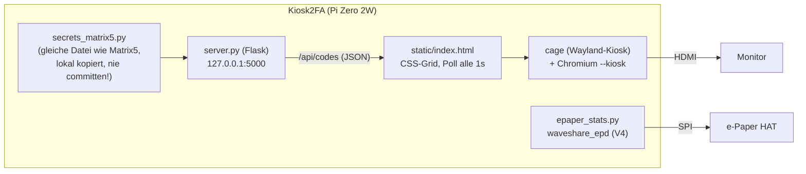

# Kiosk2FA — TOTP-Kiosk-Monitor + e-Paper-Betriebsdaten (Raspberry Pi Zero 2W)

Zweitgerät neben Matrix5: ein normaler HDMI-Monitor zeigt **alle** TOTP/2FA-Codes gleichzeitig
als Grid (kein 4-Slot-Limit wie beim HUB75-Panel), zusätzlich zeigt ein aufgestecktes
Waveshare-2.13"-e-Paper-HAT klassische Betriebsdaten (Hostname, IP, CPU-Temp, Load, RAM,
Disk, Uptime) an. Wiederverwendete Hardware: ein baugleicher Pi Zero 2W, der zuvor für das
[Bjorn](https://github.com/infinition/Bjorn)-Projekt lief.

**Status**: Produktiv, mit den echten 48 Accounts aus `secrets_matrix5.py` (identische Datei
wie auf dem Matrix5-Pi) verifiziert.

## Hardware

| Teil | Spezifikation |
|------|---------------|
| Controller | Raspberry Pi Zero 2W (BCM2710, 512MB RAM), Raspberry Pi OS Lite (Debian trixie), Python 3.13 |
| Anzeige 1 | beliebiger HDMI-Monitor über mini-HDMI, volles Grid aller Accounts |
| Anzeige 2 | Waveshare 2.13" e-Paper HAT, Platinen-Revision "Rev2.1", Panel-Generation **V4** (per Live-Test ermittelt — V2/V3-Treiber zeigten kein Bild) |
| Netzwerk | WLAN Bad!IoT (VLAN12), zusätzlich USB-Ethernet-Gadget (dwc2/g_ether) zum NUC-HA fuer direkten Konsolenzugriff |

Die SD-Karte des alten Bjorn-Betriebs war ext4-beschädigt (korrupte Extent-Bäume, `e2fsck`
brach ab) und wurde komplett neu geflasht statt repariert — die alte Bjorn-Installation war
ohnehin nicht mehr relevant.

## Software-Architektur

Kein MQTT/Home-Assistant-Bezug (anders als Matrix5) — der Monitor zeigt bewusst **alle**
Accounts gleichzeitig, keine Auswahl nötig. `server.py` importiert dieselbe
`secrets_matrix5.py` wie das Matrix5-Pi (identisches `ACCOUNTS`-Dict-Format), damit keine
zweite QR-Provisionierung nötig ist — die Datei wird einfach vom Matrix5-Pi herüberkopiert.

## Kiosk-Anzeige (HDMI)

- Backend (`server.py`, Flask) bindet nur an `127.0.0.1` — TOTP-Codes verlassen den Pi nie
  über das Netzwerk, nur der lokale Kiosk-Browser liest sie.
- Frontend: responsives CSS-Grid (`auto-fill`, min. 200px/Zelle, 10pt Gap), Name + Code +
  Countdown-Balken (grün, ab 5s Restzeit rot), Auto-Refresh per `fetch` alle 1s ohne
  Full-Reload. Account-Name (Überschrift) bricht bei Bedarf mehrzeilig um
  (`white-space: normal` + `word-break`) statt mit Ellipsis abgeschnitten zu werden — bei
  "Issuer: Konto"-Namen teils deutlich länger als der reine Issuer-Name vorher.
- Autostart: **cage** (minimaler Wayland-Kiosk-Compositor, kein X11/Desktop nötig) als
  systemd-Service mit `TTYPath=/dev/tty1` + `PAMName=login` + `Conflicts=getty@tty1.service`
  — kein Display-Manager/Autologin-Hack nötig. cage hat keinerlei Idle-/DPMS-Logik, daher
  automatisch "kein Screensaver/Dunkelschaltung" ohne weitere Konfiguration.
- **GPU-Rendering deaktiviert** (`--disable-gpu`): Chromiums GPU-Rasterization über den
  VC4/V3D-Treiber unter Wayland/Ozone lieferte nur einen weißen Bildschirm (Renderer-Prozess
  lief, aber kein Bildinhalt — per `grim`-Screenshot direkt vom Compositor-Buffer verifiziert,
  nicht nur vom HDMI-Signal). Die Seite ist reines CSS/Text ohne WebGL/Video, Software-
  Rendering ist völlig ausreichend.
- **Chromium-Übersetzungs-Bubble** ließ sich durch `--disable-translate` /
  `--disable-features=Translate` **nicht** unterdrücken (neuere Chromium-Version ignoriert
  das teilweise) — erst die Enterprise-Policy `/etc/chromium/policies/managed/kiosk2fa.json`
  (`{"TranslateEnabled": false}`) hat zuverlässig gewirkt.
- **Mauszeiger sichtbar, obwohl kein Zeigegerät angeschlossen ist (offen)**: `cursor: none`
  in der Seiten-CSS bewirkt nichts, weil der Zeiger nicht von Chromium/der Seite gerendert
  wird, sondern von **cage/wlroots selbst als Compositor-Cursor** — die HDMI-CEC-
  Fernbedienungs-Eingabe des Pi (`vc4-hdmi`) meldet Zeigefähigkeiten (`REL`-Capability) und
  lässt wlroots deshalb einen Seat-Cursor zeichnen. Versuch, das per udev-Regel
  (`LIBINPUT_IGNORE_DEVICE=1` für `vc4-hdmi`) zu unterbinden, hat **cage zuverlässig zum
  Hängenbleiben gebracht** (reagierte nicht mehr auf SIGTERM, Chromium startete gar nicht
  mehr, auch nach sauberem Neustart) — Regel wieder entfernt. Cursor bleibt bis auf Weiteres
  ein kosmetischer Makel statt eines Blockers.

## e-Paper-Betriebsdaten

`epaper_stats.py` rendert Hostname, alle IPs, CPU-Temp (`vcgencmd`/Thermal-Zone-Fallback),
Load-Average, RAM-/Disk-Belegung und Uptime, Full-Refresh alle 60s (kein Partial-Refresh —
dessen Ablauf unterscheidet sich zwischen den Waveshare-Treiberversionen und der Vorteil
[kein Flackern] spielt bei einer nur minütlich aktualisierten Anzeige keine Rolle).

**Treiber-Fallstrick**: Die Aufschrift "Rev2.1" auf der HAT-Platine bezeichnet laut Waveshare
nur die *Trägerplatine* (3.3V/5V-Pegelwandler-Revision), **nicht** die Panel-Generation
(V1-V4) — beide Angaben sind unabhängig voneinander. `epd2in13_V2` (naheliegend wegen
Kaufzeitraum) zeigte kein Bild (Panel blieb beim alten Bjorn-Inhalt stehen, obwohl der
Service fehlerfrei lief), erst `epd2in13_V4` funktionierte — verifiziert per Testbild direkt
über SSH, ohne die Karte nochmal ausbauen zu müssen.

## Bekannte Pi-Zero-2W-Stolperfallen (im Betrieb aufgetreten)

- **WLAN dreifach blockiert nach Erstflash**: `cfg80211.ieee80211_regdom=DE` im Kernel-
  Cmdline reicht *nicht* aus, um WLAN zu aktivieren — zusätzlich war (a) der `rfkill`-Softblock
  für `wlan` gesetzt (`/var/lib/systemd/rfkill/*:wlan` = `1`) und (b) NetworkManagers eigener
  State hatte `WirelessEnabled=false` (`/var/lib/NetworkManager/NetworkManager.state`). Beides
  macht normalerweise `raspi-config`s "WLAN-Land setzen"-Dialog automatisch mit — bei
  headless-Image-Vorbereitung ohne diesen Dialog muss man beides manuell nachziehen.
- **`/etc/resolv.conf` zeigte auf `8.8.8.8`** (Image-Platzhalter, extern — von Bad!IoT
  geblockt) und wurde nie von NetworkManager überschrieben, weil nie eine Verbindung
  zustande kam (Henne-Ei mit dem WLAN-Block oben). Nach dem WLAN-Fix regeneriert
  NetworkManager die Datei korrekt mit `10.10.12.1`.
- **`systemd-timesyncd` hing fest** trotz erreichbarem NTP-Server (`10.10.12.1`, direkt
  getestet auch von einem anderen Host aus) — ein einmaliges `systemctl restart
  systemd-timesyncd` nach Herstellen der WLAN-Verbindung hat genügt, danach synchronisierte
  die Uhr sofort. Ursache nicht abschließend geklärt, evtl. ein hängengebliebener erster
  Verbindungsversuch direkt beim Boot, bevor DHCP fertig war.
- **`apt-get install chromium` läuft ohne zusätzliches Swap in "Swapping Hell" fest**
  (bekanntes, gut dokumentiertes Community-Problem auf 512MB-RAM-Geräten). Fix: vor der
  Paketinstallation ein echtes 3GB-Swapfile anlegen (zusätzlich zum Standard-zram-Swap),
  bleibt dauerhaft aktiv für den laufenden Chromium-Betrieb.
- **Chromium-Wrapper zeigt bei <1GB RAM einen `zenoty`-Bestätigungsdialog** ("Launch anyway"),
  der ohne Maus/Tastatur am Kiosk nie wegklickbar wäre — `--no-memcheck`-Flag nötig.
- Siehe [[matrix5_hub75_debug]]-Memory für die analogen, bereits dort dokumentierten
  Fallstricke (WLAN-Powersave, Reboot-Loop bei parallelen Builds) — hier von Anfang an
  vermieden (Powersave von Beginn an deaktiviert, keine Kompilierung nötig da alles aus
  Debian-Paketen statt `pip install .` installiert wird).

## Account-Provisionierung (Secrets)

`secrets_matrix5.py` (identisches `ACCOUNTS`-Dict-Format wie beim Matrix5-Pi) wird einfach
vom Matrix5-Pi auf dieses Gerät kopiert (`scp` über einen kurzlebigen Zwischenstopp, danach
sofort `shred`), beide Geräte zeigen danach dieselben Accounts an — nur eben komplett statt
in 4er-Slots.

**"Issuer: Konto"-Nachimport (29.07.2026)**: `decode_ga_migration.py` auf dem Matrix5-Pi
unterstützte das `"authentik: mpauli"`-Format bereits, die vorhandene Datei war aber noch mit
der alten (nur-Issuer-)Version erzeugt worden. Google-Authenticator-Export erneut gemacht (6
QR-Seiten), Bilder diesmal per SMB-Freigabe `[vogelbad]` (`/srv/vogelbad-share`) statt Mail
übertragen (Lehre aus dem früheren Mail-Archiv-Vorfall). QR-Codes mit `zbarimg` gelesen — bei
kleinen/dichten Codes brauchte es zusätzliches Preprocessing mit ImageMagick
(Graustufen-Konvertierung + Hochskalieren 200-400%, teils zusätzlich Kontrast/Schärfen), da
die Original-Screenshots (296×640px) für manche QR-Versionen zu niedrig aufgelöst waren.
Nach dem Import lagen alte (nur-Issuer, z.B. `authentik2`/`authentik3`) und neue
(`authentik: adm_lab`) Eintraege parallel vor — alte, jetzt durch "Issuer: Konto"-Eintraege
abgedeckte Keys per Skript entfernt (44 Stück), 3 Accounts ohne separaten Kontonamen
(`ns1 (root)`, `IceP@RaidForums`, `CrowdSec`) unveraendert gelassen. Ergebnis: 48 eindeutig
benannte Accounts, `secrets_matrix5.py` auf **beiden** Pis aktualisiert (identische Datei).

## Sicherheitshinweise

- Flask-Backend bindet nur an `127.0.0.1` — TOTP-Codes sind nie übers Netzwerk erreichbar.
- **`secrets_matrix5.py` niemals committen** (`.gitignore` global auf den Dateinamen
  gesetzt) — liegt nur lokal auf dem Pi, wie beim Matrix5-Pi.
- **Physische Sichtbarkeit**: Wer auf den Monitor schauen kann, sieht ALLE aktuellen
  2FA-Codes gleichzeitig — Gerät entsprechend platzieren (bewusster Kompromiss für die
  bequeme Komplett-Übersicht).

## Offene Punkte

- [x] SD-Karte neu geflasht (alte Bjorn-Installation ext4-beschädigt)
- [x] WLAN/NTP/Swap-Fallstricke gelöst, Kiosk + e-Paper beide verifiziert produktiv
- [x] Echte Accounts: "Issuer: Konto"-Reimport gemacht, 48 Accounts auf beiden Pis synchron
- [ ] Mini-HDMI-auf-DVI-Kabel für den eigentlich vorgesehenen Monitor steht noch aus
      (Test lief über einen anderen, direkt per HDMI angeschlossenen Monitor)
- [ ] Mauszeiger dauerhaft ausblenden, ohne cage zum Haengen zu bringen (siehe
      "Kiosk-Anzeige (HDMI)" oben) - naechster Ansatz waere eher ein Kernel-seitiges
      Deaktivieren der HDMI-CEC-Eingabe (`hdmi_ignore_cec`/`hdmi_ignore_cec_init` in
      config.txt) statt einer live per udev nachgezogenen libinput-Regel
