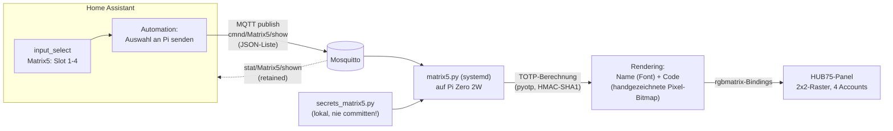

# Matrix5 — TOTP/2FA-Anzeige (HUB75 + Raspberry Pi Zero 2W)

Zeigt die aktuellen TOTP/2FA-Codes (wie Google Authenticator) auf einem RGB-LED-Panel an,
damit man beim Login nicht jedes Mal zum Handy greifen muss. Auswahl der aktuell
angezeigten Accounts läuft über Home Assistant.

**Status**: Produktiv im Einsatz. Controller ist ein **Raspberry Pi Zero 2W** (nicht mehr
ESP32-S3, siehe "Warum der Wechsel von ESP32 zu Pi" unten).

**Nur ein Panel**, keine zwei geketteten 64x32-Panels. Was wie zwei separate Module aussieht,
ist die Treiberelektronik eines einzelnen 64x32-Panels, auf zwei baugleiche PCB-Hälften
verteilt (normal bei dieser Baugröße). Teile-Aufdruck `P4-2121-64*32-16S-HL1.0` (64x32 Pixel
gesamt) bestätigt das.

Auf dem Foto:
- **links**: graues Flachbandkabel in einer weißen 16-poligen IDC-Buchse, beschriftet `DATA_IN` — **das ist der Anschluss, der zum Pi geht.**
- **rechts**: ein unbestückter 16-poliger Stiftleisten-Header, beschriftet `DATA_OUT` — für die Verkettung an ein *zweites* Panel, falls später erweitert wird (bereits bestellt). Bleibt bis dahin unbenutzt.
- **rechts daneben**: 4-poliger VCC/GND-Steckverbinder — Stromeinspeisung (5V/GND), **geht zum Netzteil, nicht zum Pi**.

## Warum der Wechsel von ESP32 zu Pi

Die ursprüngliche ESP32-S3-Firmware (`ESP32-HUB75-MatrixPanel-I2S-DMA`) hatte einen
hartnäckigen Bug: `fillScreen()` funktionierte, aber jeder Teilbereichs-Draw
(`drawPixel`/`fillRect` mit x>0 oder Breite<64) rendert vollflächig mit orange/weißem
Farbverlauf statt korrektem Bereich/Farbe. Alle naheliegenden Software-Mitigations
(clkphase, latch_blanking, Treiber-Chip-Variante, Double-Buffering) brachten nichts.

**Diagnose (26.–27.07.2026)**: Ein Raspberry Pi Zero 2W mit der `hzeller/rpi-rgb-led-matrix`-
Lib (komplett anderer Treiber-Stack) rendert denselben Panel/dieselben Kabel ohne
Pegelwandler einwandfrei sauber — Hardware/Verkabelung damit ausgeschlossen. Root Cause im
ESP32-Code gefunden: im `HUB75_I2S_CFG::i2s_pins`-Array waren **LAT und OE vertauscht**
(`{...,10,12,11,13}` statt `{...,-1,11,12,13}` in der Reihenfolge
`r1,g1,b1,r2,g2,b2,a,b,c,d,e,lat,oe,clk`) — ein vertauschtes Latch/Blanking-Paar erklärt
genau das Symptom (Vollbild übersteht falsches Timing meist unauffällig, Teilbereichs-Draws
nicht). Der Fix wäre trivial gewesen, aber da der Pi bereits nachweislich sauber lief und
WLAN/MQTT/Python direkt mitbringt (viel einfacher für die Home-Assistant-Anbindung als ein
zusätzlicher MQTT-Client auf dem ESP32), fiel die Entscheidung, den **Pi dauerhaft als
Controller zu behalten** statt zur ESP32-Firmware zurückzukehren.

## Hardware

| Teil | Spezifikation |
|------|---------------|
| Panel | P4-2121-64x32-16S-HL1.0 — 4mm Pitch, 64x32px, 1/16-Scan, HUB75(E), 1 Stück (2. Panel bereits bestellt) |
| Controller | Raspberry Pi Zero 2W, Raspberry Pi OS (Debian trixie), Python 3.13 |
| Anzeige | 2×2-Raster, bis zu 4 Accounts gleichzeitig sichtbar |

## Verkabelungsplan — Pin für Pin

**Nur die `DATA_IN`-Buchse (16-polig) wird mit dem Pi verbunden.** "regular"-GPIO-Wiring von
`rpi-rgb-led-matrix` (Standard-Layout ohne HAT):

| Ribbon-Pin | Signal | Pi-Pin (physisch) | BCM |
|---|---|---|---|
| 1 | R1 | 23 | GPIO11 |
| 2 | G1 | 13 | GPIO27 |
| 3 | B1 | 26 | GPIO7 |
| 4 | GND | 6 | — |
| 5 | R2 | 24 | GPIO8 |
| 6 | G2 | 21 | GPIO9 |
| 7 | B2 | 19 | GPIO10 |
| 8 | GND | 9 | — |
| 9 | A | 15 | GPIO22 |
| 10 | B | 16 | GPIO23 |
| 11 | C | 18 | GPIO24 |
| 12 | D | 22 | GPIO25 |
| 13 | CLK | 11 | GPIO17 |
| 14 | LAT (STB) | 7 | GPIO4 |
| 15 | OE | 12 | GPIO18 |
| 16 | GND | 14 | — |

E-Leitung (GPIO15/Pin10) nur für 1/32-Scan-Panels nötig — bei diesem 1/16-Scan-Panel unbenutzt.

Pin-Referenz für den Zero 2W: [wevolver.com — Raspberry Pi Zero 2 W Pinout Guide](https://www.wevolver.com/article/raspberry-pi-zero-2-w-pinout-comprehensive-guide-for-engineers)

Weitere Punkte (unverändert von der ESP32-Planung):
- **Pegelwandler nicht nötig** — der Pi-Test lief bei kurzen Kabeln ohne Pegelwandler sauber, genau wie später im Dauerbetrieb.
- **1000-2200µF-Elko** auf der Panel-Rückseite zwischen 5V/GND, falls nicht werksseitig verbaut.
- **Gemeinsame Masse** zwischen Netzteil und Pi nicht vergessen.
- **Stromversorgung**: eigenes 5V/GND-Adernpaar direkt vom Netzteil zum Pi, ein zweites direkt zum Panel-Stecker — nicht durch den Pi durchschleifen (siehe Dimensionierung unten).
- Mindestens 3A, besser 4A bei 5V (P4-64x32-Panel kann bei Vollbild/hoher Helligkeit kurzzeitig 3-4A ziehen); Helligkeit in Software moderat halten (`brightness`-Option, aktuell 60%).

### Bekannte Pi-Zero-2W-Stolperfallen (im Betrieb aufgetreten)

- **`snd_bcm2835`-Sound-Kernelmodul kollidiert mit Hardware-Pulse-Modus** der Matrix-Lib
  (`--led-no-hardware-pulse` bzw. Python-Option `disable_hardware_pulsing = True` nötig,
  etwas mehr Flicker als Kompromiss).
- **WLAN-Power-Save verursacht Verbindungsabbrüche** (ständiges Neu-Assoziieren am AP) —
  `nmcli con modify <profil> 802-11-wireless.powersave 2` (disable) behoben.
- **Reboot-Loop beim Kompilieren der Python-Bindings**: Pi Zero 2W hat nur ~415MB nutzbares
  RAM; ein paralleler C++-Build (mehrere gcc-Jobs) treibt das System bei knappem Speicher in
  Swap-Thrashing, wodurch der systemd-Hardware-Watchdog (60s-Timeout) das Keepalive verpasst
  und hart resettet. Fix: `CMAKE_BUILD_PARALLEL_LEVEL=1 MAKEFLAGS=-j1 pip install .`, zusätzlich
  auf Konsolen-Boot (`systemctl set-default multi-user.target`) statt Desktop-GUI umgestellt,
  da ein dauerhaftes Headless-Display ohnehin keine GUI braucht.
- **Stiller Hänger (kein Reboot!) bei geteilter Stromversorgung mit dem Panel**: Pi über die
  5V-Schiene eines 2A-Step-downs betrieben, der sich das Panel teilte. Trotz rechnerisch
  ausreichender 2A kam es zu einem kompletten, stillen Aussetzer (kein WLAN, kein Ping, kein
  Watchdog-Reset) — vermutlich ein kurzer Spannungseinbruch unter die Pi-Mindestspannung durch
  die PWM-Multiplex-Stromspitzen des Panels, der das WLAN-Modul/den SoC hängen liess, ohne einen
  sauberen Undervoltage-Reset auszulösen. `vcgencmd get_throttled` zeigte nach dem manuellen
  Neustart `0x0` (Historie durch den Neustart geloescht, daher keine nachtraegliche Bestaetigung
  moeglich). Fix/Empfehlung: Pi über eine eigene, dedizierte 5V-Quelle versorgen (separates
  Netzteil/Powerbank, min. 2,5A), Panel bleibt an seinem eigenen (stärker dimensionierten)
  Step-down — nur GND gemeinsam. Falls eine gemeinsame Quelle bleibt: deutlich überdimensionieren
  (5V/4A+) und einen Pufferkondensator (~1000-2200µF) direkt an den Pi-5V-Pins ergänzen.

## Software-Architektur

Kein Tasmota/ESPHome nötig (unverändert von der ESP32-Überlegung): HUB75(E)-RGB-LED-Module
brauchen eine kontinuierliche, hochfrequente DMA-Ansteuerung — die `rpi-rgb-led-matrix`-Lib
übernimmt das auf dem Pi über PWM/DMA trotz Linux' nicht-echtzeitfähigem Scheduler.

## Rendering-Details

Bei 64x32px physischer Auflösung ist "wie viele Accounts passen gleichzeitig drauf, noch
lesbar" ein harter Kompromiss — mehrere Iterationen mit direktem Blick aufs Panel haben zu
folgendem Design geführt:

- **Ziffern (TOTP-Code)**: handgezeichnete 4×5-Pixel-Bitmap pro Ziffer (0-9), kein
  Font/Antialiasing. Ein normaler TrueType-Font in dieser Größe verschwimmt auf dem groben
  LED-Raster (Graustufen-Kanten blenden benachbarte Pixel ineinander) — ein Fehllesen eines
  TOTP-Codes ist aber kein akzeptables Risiko, deshalb feste, eindeutige Pixelformen statt
  Font-Rendering. 1px Lücke zwischen Ziffern.
- **Name**: normaler TrueType-Font (DejaVuSansMono-Bold), Größe 10, mit Antialiasing. Ein
  Schwellwert-Trick (Graustufen hart auf An/Aus reduzieren) wurde probiert, hat bei so
  kleiner Schrift aber Buchstaben-Striche zerrissen statt sie zu schärfen — bei arbiträrem
  Text (anders als bei nur 10 Ziffernformen) gibt es keine einfache Pixel-Bitmap, deshalb
  normales Antialiasing plus ausreichend große Schrift.
- **Ergebnis**: 2×2-Raster (4 Accounts gleichzeitig), kein Rotieren durch mehr Accounts
  (war testweise eingebaut, aber unpraktisch — man muss auf den gewünschten Code warten).
  Zellgröße eng an die gemessenen Font-/Bitmap-Maße angepasst (keine verschenkten Leerzeilen).
- **Farbe**: Code grün solange TOTP-Restzeit > 5s, sonst rot (Ablauf-Warnung). Gilt pro
  Zeile identisch, da Standard-30s-TOTP-Accounts synchron ablaufen.
- Mehr Accounts gleichzeitig sichtbar → zweites (bereits bestelltes) Panel anketten, siehe
  `CHAIN_LENGTH`-Konstante im Code.

## MQTT

| Topic | Richtung | Payload |
|---|---|---|
| `cmnd/Matrix5/show` | HA → Pi | JSON-Liste der anzuzeigenden Account-Namen, max. 4 (Rest wird geloggt, aber nicht angezeigt) |
| `stat/Matrix5/shown` | Pi → HA | retained, Bestätigung der aktuell angezeigten Auswahl |

Broker: Mosquitto @NUC-HA (intern), gleiche Zugangsdaten wie die übrigen Tasmota/ESP-Geräte
im Haus.

## Home Assistant

4 `input_select`-Helfer (`Matrix5: Slot 1-4`), je ein Dropdown mit allen konfigurierten
Accounts + "(aus)" — ein Slot entspricht direkt einer der 4 Panel-Zellen. Eine Automation
publiziert bei jeder Änderung die aktuelle Auswahl aller 4 Slots als JSON-Liste auf
`cmnd/Matrix5/show`.

## Account-Provisionierung (Secrets)

Google Authenticator hat **keine öffentliche API** zum Auslesen der TOTP-Secrets (bewusst so,
sonst wäre 2FA wertlos). Weg über die App:

1. Google Authenticator → Menü → **Konten übertragen** → **Konten exportieren** → Accounts
   wählen. Bei vielen Accounts erzeugt die App **mehrere QR-Codes nacheinander**
   ("QR-Code X von Y").
2. Jeden QR-Code scannen/als Bild sichern.
3. `decode_ga_migration.py` (liegt auf dem Pi) dekodiert den `otpauth-migration://...`-Link
   **direkt auf dem Pi** und schreibt nur in `secrets_matrix5.py` — gibt dabei nur
   Account-**Namen** aus, nie die Secrets selbst. Bewusst ohne externe protobuf-Abhängigkeit:
   das Migrations-Format wird von Hand als rohes Protobuf-Wire-Format geparst (fester,
   einfacher Schema-Aufbau).
4. QR-Bilder danach löschen (`shred`) — sie enthalten die Secrets im Klartext.

**Wichtig**: Der Export-QR-Link ist genauso sensibel wie die Secrets selbst — nie
unverschlüsselt verschicken/ablegen, wo Dritte drankommen. Falls per Mail o.ä. verschickt,
Kopien (auch in Mail-Archiven!) hinterher aktiv löschen.

## Sicherheitshinweise

- **Physische Sichtbarkeit**: Wer neben dem Panel auf das Display schauen kann, sieht die
  aktuellen 2FA-Codes der 4 ausgewählten Accounts — bewusster Kompromiss, Gerät entsprechend
  platzieren.
- **`secrets_matrix5.py` niemals committen** — lokal per `.gitignore` ausgeschlossen, liegt
  nur auf dem Pi.
- **Keine echten TOTP-Secrets in Screenshots/Doku** — auch nicht in diesem Repo.
- Google-Authenticator-"Konten übertragen"-Export bündelt (ggf. über mehrere QR-Codes) alle
  gewählten Secrets im Klartext — niemand sonst darf diesen QR/Link zu Gesicht bekommen.

## Offene Punkte

- [x] Panel identifiziert (nur eines, nicht zwei) + Pin-Zuordnung verifiziert
- [x] ESP32-Bug gefunden (LAT/OE vertauscht) — Entscheidung: Pi bleibt dauerhaft Controller
- [x] Pi-Provisionierung, systemd-Service, HA-Integration (4 Slots + Automation) produktiv
- [x] Vollständige Account-Bezeichnungen ("Dienst: Konto") — 29.07. erneuter Export-Durchlauf
      gemacht (siehe [[kiosk2fa_epaper]]-Memory bzw. `docs/kiosk2fa-epaper.md`, da
      `secrets_matrix5.py` inzwischen von beiden Pis geteilt wird), 48 Accounts
- [ ] Zweites Panel anketten (bereits bestellt) für mehr gleichzeitig sichtbare Accounts
- [ ] Foto des fertig verkabelten (Pi ↔ Panel) Aufbaus ergänzen
- [ ] Pi auf eigene, dedizierte 5V-Stromversorgung umstellen (aktuell geteilter 2A-Step-down
      mit dem Panel führte am 28.07. zu einem stillen Aussetzer des Pi ohne Watchdog-Reset)
