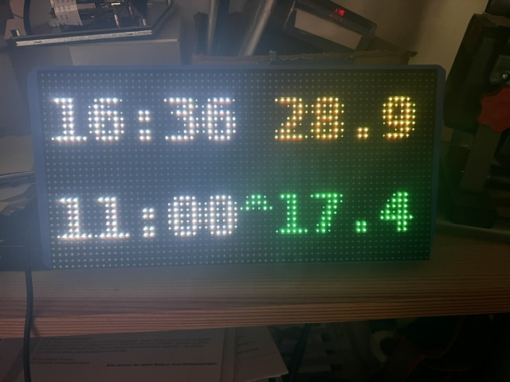
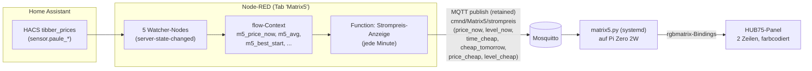

# Matrix5 — Stromkosten-/Waschzeitpunkt-Anzeige (HUB75 + Raspberry Pi Zero 2W)

Zeigt auf einem RGB-LED-Panel im Waschkeller den aktuellen Strompreis (ct/kWh) und die
nächste günstigere Zeit — quasi eine zweite, eigene "Tibber-Ampel" neben der bestehenden
Tasmota-Ampel, aber mit konkreten Zahlen statt nur Rot/Gelb/Grün.

**Status**: Produktiv seit 29.07.2026.

> **Historie**: Dieses Panel diente vorher als TOTP/2FA-Anzeige (siehe Git-Historie dieser
> Datei, vormals `matrix5-totp.md`). Diese Aufgabe hat komplett
> [Kiosk2FA](https://github.com/icepaule/Ice-2FA-Kiosk) übernommen (zeigt alle Accounts
> gleichzeitig, kein 4-Slot-Limit) — das Matrix5-Panel war dadurch frei für eine neue Aufgabe.
> Hardware (Pi Zero 2W + 64x32-HUB75-Panel), Verkabelung und die Pi-Zero-2W-Stolperfallen
> unten sind unverändert von damals gültig.

## Anzeige

Zwei Zeilen, Uhrzeit jeweils weiß, nur der Preisteil farbcodiert:
- **Zeile 1**: aktuelle Uhrzeit + aktueller Preis (ct/kWh)
- **Zeile 2**: nächste günstigere Zeit + der dann gültige Preis — oder `JETZT`, falls der
  aktuelle Moment bereits die günstigste Preisperiode des Tages ist. Liegt die günstigste
  Zeit erst am Folgetag, steht statt eines Leerzeichens ein `^` zwischen Uhrzeit und Preis
  (sonst wirkt z.B. "11:00" nachmittags wie eine bereits verstrichene Vormittagszeit von
  heute statt wie morgen früh).

Der Preisteil ist farbcodiert nach Preis-Einstufung (gleiche Schwellwerte wie die bestehende
`sensor.tibber_preis_status`-Vorlage in Home Assistant):

| Farbe | Bedeutung | Schwelle |
|---|---|---|
| Grün | günstig | < 70% vom Tagesdurchschnitt |
| Gelb | normal | 70–130% vom Tagesdurchschnitt |
| Rot | teuer | > 130% vom Tagesdurchschnitt |

## Architektur

Die eigentliche Preis-/Zeitfenster-Logik (Tagesdurchschnitt, günstigste/teuerste Periode,
"sind wir gerade in der günstigsten Periode", "ist die günstigste Zeit heute oder morgen")
läuft komplett in **Node-RED** (nicht als HA-YAML-Automation - Projektkonvention ist, alle
Automationen als Node-RED-Flow abzubilden, siehe `config/nodered/matrix_flows.json`, Tab
"Matrix5 (Strompreis)"). Watcher-Nodes lesen die `tibber_prices`-Sensoren, ein
`Jede-Minute`-Inject-Node triggert die Anzeige-Function, die den JSON-Payload baut. Der Pi
selbst rechnet nichts, er zeigt nur an, was ihm per MQTT gesagt wird, und hält nur die
Uhrzeit selbst sekundengenau nach.

## Der Bug, der alles blockierte

Beim Aufsetzen zeigte `sensor.paule_current_electricity_price` und alle verwandten Sensoren
hartnäckig `unknown` — obwohl die Integration in den Logs sichtbar aktiv Daten verarbeitete
("Calculating baseline periods...", "Success with flex=38%..."). Ursache, in zwei Schichten:

1. Der Config-Entry der `tibber_prices`-Integration war **komplett deaktiviert**
   (`disabled_by: "user"`) — vermutlich ein Überbleibsel aus einem früheren Test, nie wieder
   aktiviert.
2. Reines Aktivieren des Config-Entries reichte nicht: Alle ~150 Entities dieser Integration
   waren zusätzlich einzeln mit `disabled_by: "device"` markiert — eine Kaskade, die beim
   ursprünglichen Deaktivieren des Geräts gesetzt wurde und beim bloßen Wieder-Aktivieren des
   Config-Entries **nicht** automatisch mit aufgehoben wird.

Zusätzlicher Fallstrick dabei: Direktes Bearbeiten der `.storage`-Registry-Dateien während
Home Assistant läuft wird von HA beim nächsten Neustart aus dem Arbeitsspeicher wieder
überschrieben (HA hält die Registry im RAM und persistiert sie periodisch/beim Neustart) —
Home Assistant musste dafür komplett **gestoppt** (nicht nur neu gestartet), erst dann
bearbeitet, dann wieder gestartet werden.

## Node-RED

Tab "Matrix5 (Strompreis)" in `config/nodered/matrix_flows.json`. Fünf
`server-state-changed`-Watcher-Nodes (je einer pro Sensor unten) schreiben in den
Flow-Context, ein `Jede-Minute`-Inject triggert die `Strompreis-Anzeige`-Function, die daraus
den JSON-Payload baut und per `mqtt out` (retained) an `cmnd/Matrix5/strompreis` sendet.
Genutzte `tibber_prices`-Sensoren:

| Sensor | Verwendung |
|---|---|
| `sensor.paule_current_electricity_price` | aktueller Preis |
| `sensor.paule_today_s_lowest_price` | Preis der günstigsten Periode heute |
| `sensor.paule_best_price_start` | Startzeit der nächsten günstigsten Periode |
| `binary_sensor.paule_best_price_period` | sind wir *gerade* in der günstigsten Periode? |
| `sensor.paule_price_today` (Attribut `price_mean`) | Tagesdurchschnitt für die Ampel-Einstufung |

**Sonderfall "JETZT"**: `sensor.paule_best_price_start` zeigt die *nächste* Periode an — sind
wir bereits mittendrin, gibt es keine "nächste" mehr und der Sensor liefert `unknown`. Das ist
kein Fehler, sondern korrektes Verhalten (kein Sensor zeigt "die Zukunft" der Gegenwart) —
das Template prüft deshalb zuerst `binary_sensor.paule_best_price_period` und zeigt in dem
Fall `JETZT` statt einer (nicht existenten) zukünftigen Uhrzeit.

## MQTT

| Topic | Richtung | Payload |
|---|---|---|
| `cmnd/Matrix5/strompreis` | Node-RED → Pi | retained JSON: `price_now`, `level_now`, `time_cheap`, `cheap_tomorrow`, `price_cheap`, `level_cheap` |

## Hardware

| Teil | Spezifikation |
|------|---------------|
| Panel | P4-2121-64x32-16S-HL1.0 — 4mm Pitch, 64x32px, 1/16-Scan, HUB75(E) |
| Controller | Raspberry Pi Zero 2W, Raspberry Pi OS (Debian trixie), Python 3.13 |

Verkabelung, Pin-Zuordnung und Stromversorgungs-Dimensionierung unverändert von der
ursprünglichen TOTP-Version — siehe Git-Historie dieser Datei für den vollständigen
Pin-für-Pin-Plan und das Wiring-Diagramm.

### Bekannte Pi-Zero-2W-Stolperfallen (unverändert relevant)

- `snd_bcm2835`-Sound-Kernelmodul kollidiert mit Hardware-Pulse-Modus der Matrix-Lib
  (`disable_hardware_pulsing = True` nötig).
- WLAN-Power-Save verursacht Verbindungsabbrüche (deaktiviert).
- Geteilte Stromversorgung mit dem Panel kann zu stillen Aussetzern führen (siehe
  Git-Historie) — Pi hat eine eigene, dedizierte 5V-Quelle.

## Sicherheitshinweise

- Keine Zugangsdaten oder personenbezogene Verbrauchsdaten in diesem Repo — nur Sensor-
  Entity-Namen und Schwellwerte, keine echten Preis-/Verbrauchshistorien.
- MQTT-Broker-Zugangsdaten liegen nur lokal auf dem Pi (`matrix5.py`), nicht im Repo.

## Offene Punkte

- [x] Umstellung von TOTP-Anzeige auf Stromkosten-/Waschzeitpunkt-Anzeige
- [x] `tibber_prices`-Integration reaktiviert (war disabled, Config-Entry + kaskadierte Entities)
- [x] Farbcodierung nach Preis-Einstufung (günstig/normal/teuer), Uhrzeit separat weiß
- [x] "Morgen"-Marker (`^`) statt nur Uhrzeit ohne Datumsbezug
- [x] Von HA-YAML-Automation auf Node-RED migriert (Projektkonvention: alle Automationen als Flow)
- [ ] Zweites Panel (aus der TOTP-Ära bereits bestellt) — Verwendungszweck für die
      Stromkosten-Anzeige noch offen, evtl. für einen zweiten Standort im Haus
