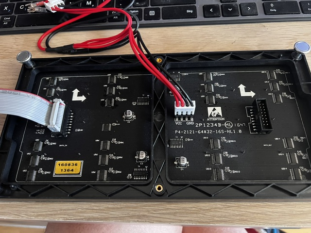
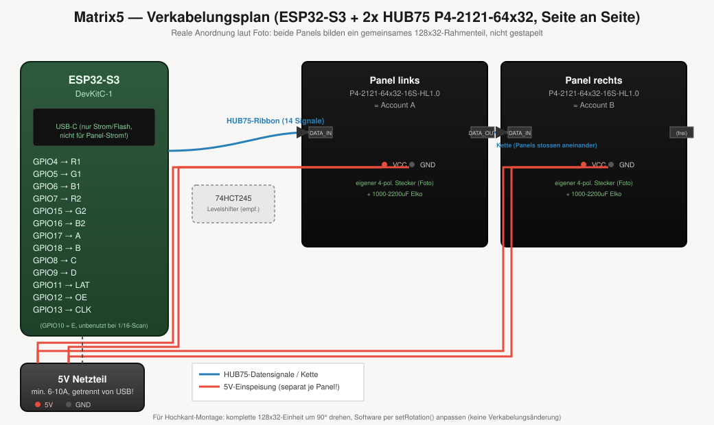
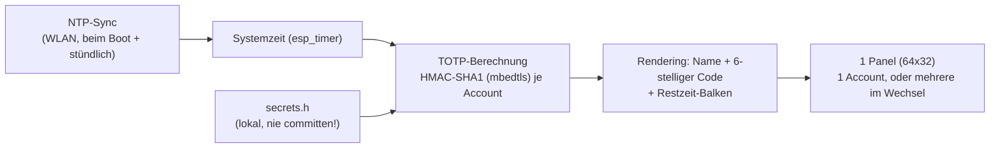

# Matrix5 — TOTP/2FA-Anzeige (HUB75 + ESP32-S3)

Zeigt die aktuellen TOTP/2FA-Codes (wie Google Authenticator) auf einem RGB-LED-Panel an,
damit man beim Login nicht jedes Mal zum Handy greifen muss. Läuft komplett unabhängig von
Tasmota/Node-RED/Home Assistant auf einer eigenen ESP32-S3-Firmware.

**Status**: Hardware identifiziert, WLAN/NTP-Smoketest erfolgreich. Firmware für die eigentliche
TOTP-Anzeige noch nicht final geflasht.



**Korrektur (nach genauerem Blick aufs Foto): es ist nur EIN Panel**, keine zwei geketteten
64x32-Panels. Was wie zwei separate Module aussieht, ist die Treiberelektronik eines einzelnen
64x32-Panels, auf zwei baugleiche PCB-Hälften verteilt (normal bei dieser Baugröße, jede Hälfte
hat ihre eigenen Shift-Register-/Treiber-ICs). Erkennbar am gemeinsamen Rahmen mit durchgehenden
Eckbohrungen und daran, dass der Teile-Aufdruck `P4-2121-64*32-16S-HL1.0` (64x32 Pixel gesamt)
nur einmal vorkommt.

Auf dem Foto:
- **links**: graues Flachbandkabel, bereits in eine weiße 16-polige IDC-Buchse gesteckt, beschriftet `DATA_IN` — **das ist der Anschluss, der zum ESP32 geht.**
- **rechts**: ein unbestückter 16-poliger Stiftleisten-Header, beschriftet `DATA_OUT` — für die Verkettung an ein *zweites* Panel, falls später erweitert wird. **Bleibt bei nur einem Panel unbenutzt, nicht anschließen.**
- **rechts daneben**: 4-poliger VCC/GND-Steckverbinder mit rot/schwarzen Adern — Stromeinspeisung (5V/GND), **geht zum Netzteil, nicht zum ESP32**

## Warum kein Tasmota / ESPHome

HUB75(E)-RGB-LED-Module brauchen eine kontinuierliche, hochfrequente DMA-Ansteuerung. Tasmota hat
dafür keinen Treiber (nur MAX7219/OLED/Nextion-artige Displays). ESPHome hat zwar einen
`hub75`-Component, aber keine TOTP/HMAC-Funktion eingebaut — das müsste per Custom-C++-Component
nachgerüstet werden, was am Ende genauso viel Aufwand ist wie eine eigene Firmware. Deshalb:
PlatformIO/Arduino-C++ direkt auf dem ESP32-S3.

## Hardware

| Teil | Spezifikation |
|------|---------------|
| Panel | P4-2121-64x32-16S-HL1.0 — 4mm Pitch, 64x32px, 1/16-Scan, HUB75(E), 1 Stück |
| Controller | ESP32-S3 (embedded PSRAM), Arduino/PlatformIO |
| Anzeige | 1 Panel = 1 Account permanent sichtbar, oder mehrere Accounts im Wechsel (Timer) |

## Verkabelungsplan — Pin für Pin



**Nur die `DATA_IN`-Buchse (16-polig, links auf dem Foto) wird mit dem ESP32 verbunden.** Standard-HUB75-Pinbelegung (16-pol., zickzack-nummeriert — Pin 1 meist durch eine rote Ader oder eine Kerbe/Nase am Steckergehäuse markiert, unbedingt vor dem Anschließen prüfen, sonst ist die ganze Zuordnung um 1 verschoben):

| Ribbon-Pin | Signal | ESP32-Pin (Zahl auf dem Board) |
|---|---|---|
| 1 | R1 | 4 |
| 2 | G1 | 5 |
| 3 | B1 | 6 |
| 4 | GND | GND |
| 5 | R2 | 7 |
| 6 | G2 | 15 |
| 7 | B2 | 16 |
| 8 | GND | GND |
| 9 | A | 17 |
| 10 | B | 18 |
| 11 | C | 8 |
| 12 | D | 9 |
| 13 | CLK | 13 |
| 14 | LAT (STB) | 11 |
| 15 | OE | 12 |
| 16 | GND | GND |

Diese Tabelle ist der **Standard-16-pol.-HUB75(E)-Belegung** entnommen (passt zu einem 1/16-Scan-Panel mit A-D-Adresslinien, kein E nötig — Pinzahl 16 statt 20 bestätigt das). Trotzdem: **am eigenen Kabel die Pin-1-Markierung verifizieren**, bevor irgendwas angeschlossen wird — Fotos/Silkscreen-Aufdrucke variieren je Hersteller/Charge.

Weitere Punkte:
- **`DATA_OUT`-Header (rechts, 16-pol., unbestückt) bleibt unbenutzt** — nur relevant, falls später ein zweites Panel angekettet wird.
- **4-poliger VCC/GND-Steckverbinder** ist die Stromversorgung — geht ans Netzteil (siehe unten), nicht an den ESP32-Datenbus.
- **1000-2200µF-Elko** auf der Panel-Rückseite zwischen 5V/GND (gegen Spannungseinbrüche), falls nicht schon werksseitig verbaut.
- **Pegelwandler (74HCT245) empfohlen**: ESP32-S3 liefert 3,3V-Logik, HUB75-Panels erwarten 5V — bei kurzen Kabeln funktioniert es oft auch ohne, mit Levelshifter ist das Bild stabiler.
- **Gemeinsame Masse** zwischen Netzteil und ESP32-S3 nicht vergessen (siehe Stromversorgung unten).

### Stromversorgung — geht das mit nur einem Netzteil?

Ja, aber **nicht indem der Panel-Strom durchs ESP32-Board geleitet wird** (also nicht: Netzteil →
ESP32-USB-Port → 5V-Pin des ESP32 → Panel). Das 5V-Pin eines Dev-Boards ist meist nur für kleine
Zusatzverbraucher gedacht (dünne Leiterbahn/Pad, teils mit Mini-Sicherung auf der 5V-Schiene) —
für ein LED-Panel mit ein paar Ampere Spitzenlast nicht ausgelegt, selbst wenn das Netzteil selbst
das liefern könnte.

**Stattdessen**: ein einziges 5V-Netzteil nehmen und **direkt an der Quelle auf zwei Adernpaare
aufteilen** — ein Paar geht auf den 5V/GND-Pin des ESP32 (Board dann *nicht* zusätzlich über USB
mit Strom versorgen, nur noch fürs Flashen per USB anstecken), das andere Paar direkt auf den
4-poligen VCC/GND-Stecker des Panels. Beide Adernpaare kommen vom selben Netzteil, aber keines
läuft durch das ESP32-Board durch — elektrisch sauber, und trotzdem nur ein Stecker in der
Steckdose.

**Zur Dimensionierung**: ein reines P4-64x32-Panel kann bei voller Helligkeit/komplett weißem
Bild kurzzeitig 3-4A ziehen — ein 2,0A-USB-Netzteil reicht dafür im Extremfall nicht.
Für die TOTP-Anzeige (dünne Ziffern auf überwiegend schwarzem Hintergrund, kein Vollbild) liegt
der reale Verbrauch deutlich niedriger, aber sicherheitshalber:
- Netzteil mit **mindestens 3A, besser 4A** bei 5V wählen (Aufpreis minimal, Sicherheitsmarge groß)
- Helligkeit in der Software moderat begrenzen (`setBrightness8()`, z.B. 40-60 von 255) statt auf Maximum zu laufen
- Falls unbedingt bei 2A bleiben soll: nur mit niedriger Helligkeit betreiben und im Zweifel mit einem Multimeter den realen Stromverbrauch bei eurem tatsächlichen Anzeigeinhalt messen, bevor ihr euch drauf verlasst

#### Wenn der ESP32 auf einem Perfboard sitzt

Die "zwei Adernpaare ab der Quelle"-Aufteilung von oben lässt sich genauso auf einem Perfboard
umsetzen, **ohne das USB-Kabel anschneiden zu müssen** — es kommt nur darauf an, *wo* genau
abgegriffen wird:

- **Nicht** das Panel-Kabel an den 5V-Pin des ESP32-*Moduls* selbst löten — dessen Pad/Leiterbahn
  ist meist nur für den Eigenbedarf des Chips ausgelegt.
- **Stattdessen** einen eigenen kleinen 5V/GND-Knotenpunkt auf dem Perfboard anlegen, an dem das
  Netzteilkabel zuerst ankommt. Von diesem einen Punkt aus zwei getrennte Leitungen abgehen
  lassen: eine zum 5V-Pin des ESP32 (versorgt nur den Chip, wenig Strom), eine zweite —
  ausreichend dick dimensioniert — direkt zum 4-poligen VCC/GND-Stecker des Panels. So läuft der
  Panel-Strom nie durchs ESP32-Modul, sondern beide hängen parallel am selben Speisepunkt.
- Der ESP32 wird dann über den 5V-Pin extern versorgt statt über USB — USB bleibt nur fürs
  Flashen angeschlossen (bei den meisten Boards dank Verpolungsschutz-Diode auch gefahrlos
  parallel möglich, im Zweifel beim Flashen extern kurz trennen).
- **Leitungsquerschnitt**: für die beiden Stromleitungen (Netzteil→Knotenpunkt, Knotenpunkt→Panel)
  eher 20-22 AWG statt dünner 24-AWG-Jumperkabel — bei 1-2A macht sich dünner Draht sonst als
  Spannungsabfall bemerkbar.
- Bei nur 2A Netzteil-Budget bleibt ohnehin wenig Reserve (der ESP32 zieht bei WLAN-Sendespitzen
  allein schon 300-500mA) — Helligkeit niedrig ansetzen und einmal nachmessen, siehe oben.

## Software-Architektur



Wichtig: VLAN12 (Bad!IoT) blockt externes NTP (UDP/123) nach außen — die interne Gateway-IP
muss in der NTP-Serverliste **zuerst** stehen, sonst bleibt die Zeit auf 1970/2000 stehen und
alle TOTP-Codes sind falsch (siehe Lessons Learned im Solar-Tracker-Projekt, gleiche Falle).

## Code-Gerüst

Da es nur ein Panel ist, reicht die einfache `MatrixPanel_I2S_DMA`-Instanz — kein
`VirtualMatrixPanel`/Chaining nötig.

```cpp
#include <WiFi.h>
#include <ESP32-HUB75-MatrixPanel-I2S-DMA.h>
#include <mbedtls/md.h>
#include "secrets.h"

#define PANEL_RES_X 64
#define PANEL_RES_Y 32
#define PANEL_CHAIN 1

MatrixPanel_I2S_DMA *dma_display = nullptr;

// RFC 4648 Base32-Decoder
int base32_decode(const char* encoded, uint8_t* out, int outMax) {
    static const char* ALPHABET = "ABCDEFGHIJKLMNOPQRSTUVWXYZ234567";
    int buffer = 0, bitsLeft = 0, count = 0;
    for (const char* p = encoded; *p; p++) {
        char c = toupper(*p);
        const char* pos = strchr(ALPHABET, c);
        if (!pos) continue;
        buffer = (buffer << 5) | (pos - ALPHABET);
        bitsLeft += 5;
        if (bitsLeft >= 8) {
            if (count < outMax) out[count++] = (buffer >> (bitsLeft - 8)) & 0xFF;
            bitsLeft -= 8;
        }
    }
    return count;
}

// RFC 6238 TOTP
uint32_t totp_generate(const uint8_t* key, size_t keyLen, time_t t, int digits = 6) {
    uint64_t counter = t / 30;
    uint8_t msg[8];
    for (int i = 7; i >= 0; i--) { msg[i] = counter & 0xFF; counter >>= 8; }

    uint8_t hmac[20];
    mbedtls_md_context_t ctx;
    mbedtls_md_init(&ctx);
    mbedtls_md_setup(&ctx, mbedtls_md_info_from_type(MBEDTLS_MD_SHA1), 1);
    mbedtls_md_hmac_starts(&ctx, key, keyLen);
    mbedtls_md_hmac_update(&ctx, msg, 8);
    mbedtls_md_hmac_finish(&ctx, hmac);
    mbedtls_md_free(&ctx);

    int offset = hmac[19] & 0x0F;
    uint32_t bin = ((hmac[offset] & 0x7F) << 24) | (hmac[offset+1] << 16) |
                   (hmac[offset+2] << 8) | hmac[offset+3];
    uint32_t mod = 1; for (int i = 0; i < digits; i++) mod *= 10;
    return bin % mod;
}

void setup() {
    WiFi.begin(WIFI_SSID, WIFI_PASS);
    while (WiFi.status() != WL_CONNECTED) delay(200);

    // Internes Gateway zuerst, sonst blockiert das IoT-VLAN externes NTP
    configTime(0, 0, "<Gateway-IP>", "pool.ntp.org");
    while (time(nullptr) < 1700000000) delay(200);

    HUB75_I2S_CFG::i2s_pins pins = {4,5,6,7,15,16,17,18,8,9,10,11,12,13};
    HUB75_I2S_CFG mxconfig(PANEL_RES_X, PANEL_RES_Y, PANEL_CHAIN, pins);
    dma_display = new MatrixPanel_I2S_DMA(mxconfig);
    dma_display->begin();
    dma_display->setBrightness8(50); // moderat halten, siehe Stromversorgung oben
}

void loop() {
    // je Account: base32_decode(secret) -> totp_generate() -> auf dma_display zeichnen
    // bei mehreren Accounts: alle paar Sekunden durchwechseln (nur 1 Panel = 1 Anzeige gleichzeitig)
}
```

`secrets.h` (Beispiel, **niemals mit echten Secrets committen**):

```cpp
#pragma once
struct Account { const char* name; const char* base32secret; uint16_t color; };

// JBSWY3DPEHPK3PXP ist der öffentliche RFC-6238-Testvektor, kein echtes Secret
Account accounts[] = {
    { "Beispiel", "JBSWY3DPEHPK3PXP", 0xF800 },
};
```

## Sicherheitshinweise

- **Physische Sichtbarkeit**: Wer neben dem Monitor auf das Display schauen kann, sieht die aktuellen 2FA-Codes — bewusster Kompromiss, Gerät entsprechend platzieren.
- **`secrets.h` niemals committen** — lokal per `.gitignore` ausschließen, auch nicht in abgewandelter Form (siehe Lessons Learned unten zur Git-History).
- **Keine echten TOTP-Secrets in Screenshots/Doku** — auch nicht in diesem Repo, auch nicht in Kommentaren oder Issues.
- Google-Authenticator-"Konten übertragen"-Export bündelt alle Secrets in einem QR — falls zur Migration genutzt, diesen QR nirgendwo teilen (entspricht vollem 2FA-Bypass für alle enthaltenen Accounts).

## Offene Punkte

- [x] Panel identifiziert (nur eines, nicht zwei) + Pin-Zuordnung anhand Foto verifiziert
- [ ] Finale Firmware mit echten Accounts flashen (secrets bleiben lokal, nie im Repo)
- [ ] Gehäuse/Standfuß
- [ ] Foto des fertig verkabelten (ESP32 ↔ Panel) Aufbaus ergänzen
