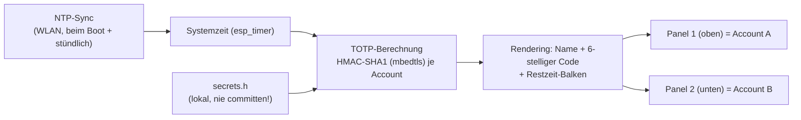

# Matrix5 — TOTP/2FA-Anzeige (HUB75 + ESP32-S3)

Zeigt die aktuellen TOTP/2FA-Codes (wie Google Authenticator) auf zwei RGB-LED-Panels an,
damit man beim Login nicht jedes Mal zum Handy greifen muss. Läuft komplett unabhängig von
Tasmota/Node-RED/Home Assistant auf einer eigenen ESP32-S3-Firmware.

**Status**: Hardware erkannt und getestet (WLAN/NTP-Smoketest erfolgreich), Firmware für die
eigentliche TOTP-Anzeige noch nicht final geflasht. Foto folgt, sobald der Aufbau fertig verkabelt ist.

## Warum kein Tasmota / ESPHome

Die Panels sind HUB75(E)-RGB-LED-Module (siehe unten) — die brauchen eine kontinuierliche,
hochfrequente DMA-Ansteuerung. Tasmota hat dafür keinen Treiber (nur MAX7219/OLED/Nextion-artige
Displays). ESPHome hat zwar einen `hub75`-Component, aber keine TOTP/HMAC-Funktion eingebaut —
das müsste per Custom-C++-Component nachgerüstet werden, was am Ende genauso viel Aufwand ist
wie eine eigene Firmware. Deshalb: PlatformIO/Arduino-C++ direkt auf dem ESP32-S3.

## Hardware

| Teil | Spezifikation |
|------|---------------|
| Panel (x2) | P4-2121-64x32-16S-HL1.0 — 4mm Pitch, 64x32px, 1/16-Scan, HUB75(E) |
| Controller | ESP32-S3 (embedded PSRAM), Arduino/PlatformIO |
| Anzeige | 2 Panels = 2 Accounts gleichzeitig sichtbar (übereinander montiert) |

## Verkabelungsplan


- **Stromversorgung getrennt vom Datenkabel einspeisen** — jedes Panel bekommt eigene 5V/GND-Adern direkt vom Netzteil, nicht über das dünne HUB75-Ribbon. Pro Panel bis zu ~2,5A Spitzenlast bei voller Helligkeit.
- **1000-2200µF-Elko** auf der Rückseite jedes Panels zwischen 5V/GND (gegen Spannungseinbrüche).
- **Pegelwandler (74HCT245) empfohlen**: ESP32-S3 liefert 3,3V-Logik, HUB75-Panels erwarten 5V — bei kurzen Kabeln funktioniert es oft auch ohne, mit Levelshifter ist das Bild stabiler.
- **Gemeinsame Masse** zwischen Netzteil und ESP32-S3 nicht vergessen.
- Zwei Panels werden als **eine Kette** betrieben (Panel1 OUT → Panel2 IN), nicht als zwei getrennte Busse — die Software behandelt sie über einen `VirtualMatrixPanel` (Chain-Type vertikal) als eine durchgehende 64x64-Canvas.

### GPIO-Beispielbelegung (ESP32-S3, generisch)

| Signal | GPIO | Signal | GPIO |
|---|---|---|---|
| R1 | 4 | A | 17 |
| G1 | 5 | B | 18 |
| B1 | 6 | C | 8 |
| R2 | 7 | D | 9 |
| G2 | 15 | LAT | 11 |
| B2 | 16 | OE | 12 |
| E (unbenutzt bei 1/16-Scan) | 10 | CLK | 13 |

Getestet gegen ein reales Board (ESP32-S3, embedded 8MB PSRAM): diese Pins liegen außerhalb der
PSRAM-reservierten GPIOs (33-37), der Strapping-Pins (0/3/45/46) und der USB-Pins (19/20) — vor
dem Nachbau trotzdem gegen das eigene Board-Pinout prüfen, insbesondere bei Octal-PSRAM-Varianten.

## Software-Architektur



Wichtig: VLAN12 (Bad!IoT) blockt externes NTP (UDP/123) nach außen — die interne Gateway-IP
muss in der NTP-Serverliste **zuerst** stehen, sonst bleibt die Zeit auf 1970/2000 stehen und
alle TOTP-Codes sind falsch (siehe Lessons Learned im Solar-Tracker-Projekt, gleiche Falle).

## Code-Gerüst

```cpp
#include <WiFi.h>
#include <ESP32-HUB75-MatrixPanel-I2S-DMA.h>
#include <mbedtls/md.h>
#include "secrets.h"

#define PANEL_RES_X 64
#define PANEL_RES_Y 32
#define PANEL_CHAIN 2

MatrixPanel_I2S_DMA *dma_display = nullptr;
VirtualMatrixPanel  *virtualDisp = nullptr;

// RFC 4648 Base32-Decoder
int base32_decode(const char* encoded, uint8_t* out, int outMax) {
    static const char* ALPHABET = "ABCDEFGHIJKLMNOPQRSTUVWXYZ234567";
    int buffer = 0, bitsLeft = 0, count = 0;
    for (const char* p = encoded; *p; p++) {
        char c = toupper(*p);
        const char* pos = strchr(ALPHABET, c);
        if (!pos) continue;
        buffer = (buffer << 5) | (pos - ALPHABET);
        bitsLeft += 5;
        if (bitsLeft >= 8) {
            if (count < outMax) out[count++] = (buffer >> (bitsLeft - 8)) & 0xFF;
            bitsLeft -= 8;
        }
    }
    return count;
}

// RFC 6238 TOTP
uint32_t totp_generate(const uint8_t* key, size_t keyLen, time_t t, int digits = 6) {
    uint64_t counter = t / 30;
    uint8_t msg[8];
    for (int i = 7; i >= 0; i--) { msg[i] = counter & 0xFF; counter >>= 8; }

    uint8_t hmac[20];
    mbedtls_md_context_t ctx;
    mbedtls_md_init(&ctx);
    mbedtls_md_setup(&ctx, mbedtls_md_info_from_type(MBEDTLS_MD_SHA1), 1);
    mbedtls_md_hmac_starts(&ctx, key, keyLen);
    mbedtls_md_hmac_update(&ctx, msg, 8);
    mbedtls_md_hmac_finish(&ctx, hmac);
    mbedtls_md_free(&ctx);

    int offset = hmac[19] & 0x0F;
    uint32_t bin = ((hmac[offset] & 0x7F) << 24) | (hmac[offset+1] << 16) |
                   (hmac[offset+2] << 8) | hmac[offset+3];
    uint32_t mod = 1; for (int i = 0; i < digits; i++) mod *= 10;
    return bin % mod;
}

void setup() {
    WiFi.begin(WIFI_SSID, WIFI_PASS);
    while (WiFi.status() != WL_CONNECTED) delay(200);

    // Internes Gateway zuerst, sonst blockiert das IoT-VLAN externes NTP
    configTime(0, 0, "<Gateway-IP>", "pool.ntp.org");
    while (time(nullptr) < 1700000000) delay(200);

    HUB75_I2S_CFG::i2s_pins pins = {4,5,6,7,15,16,17,18,8,9,10,11,12,13};
    HUB75_I2S_CFG mxconfig(PANEL_RES_X, PANEL_RES_Y, PANEL_CHAIN, pins);
    dma_display = new MatrixPanel_I2S_DMA(mxconfig);
    dma_display->begin();
    dma_display->setBrightness8(60);

    virtualDisp = new VirtualMatrixPanel(*dma_display, 2, 1, PANEL_RES_X, PANEL_RES_Y);
    virtualDisp->setPhysicalPanelType(CHAIN_TOP_LEFT_DOWN);
}

void loop() {
    // je Account: base32_decode(secret) -> totp_generate() -> auf virtualDisp zeichnen
    // Details/vollständiges Beispiel: siehe Chat-Historie dieses Projekts
}
```

`secrets.h` (Beispiel, **niemals mit echten Secrets committen**):

```cpp
#pragma once
struct Account { const char* name; const char* base32secret; uint16_t color; };

// JBSWY3DPEHPK3PXP ist der öffentliche RFC-6238-Testvektor, kein echtes Secret
Account accounts[] = {
    { "Beispiel", "JBSWY3DPEHPK3PXP", 0xF800 },
};
```

## Sicherheitshinweise

- **Physische Sichtbarkeit**: Wer neben dem Monitor auf das Display schauen kann, sieht die aktuellen 2FA-Codes — bewusster Kompromiss, Gerät entsprechend platzieren.
- **`secrets.h` niemals committen** — lokal per `.gitignore` ausschließen, auch nicht in abgewandelter Form (siehe Lessons Learned unten zur Git-History).
- **Keine echten TOTP-Secrets in Screenshots/Doku** — auch nicht in diesem Repo, auch nicht in Kommentaren oder Issues.
- Google-Authenticator-"Konten übertragen"-Export bündelt alle Secrets in einem QR — falls zur Migration genutzt, diesen QR nirgendwo teilen (entspricht vollem 2FA-Bypass für alle enthaltenen Accounts).

## Offene Punkte

- [ ] Finale Firmware mit echten Accounts flashen (secrets bleiben lokal, nie im Repo)
- [ ] Gehäuse/Standfuß für Hochkant-Aufstellung
- [ ] Foto des fertigen Aufbaus ergänzen
