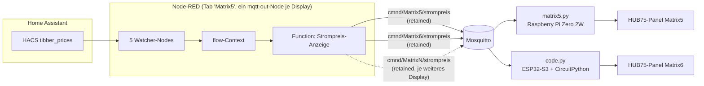

# Matrix6 — Stromkosten-/Waschzeitpunkt-Anzeige auf ESP32-S3 + CircuitPython (HUB75)

Zweiter Standort im Haus mit derselben Anzeige wie [Matrix5](matrix5-strompreis.md) — aktueller
Strompreis + nächste günstigere Zeit — aber auf komplett anderer Hardware: **ESP32-S3 mit
CircuitPython statt Raspberry Pi Zero 2W**. Diese Anleitung ist bewusst als **Schritt-für-Schritt-
Bauanleitung** geschrieben, die sich 1:1 für weitere baugleiche Displays (MatrixN) wiederholen
lässt — nur der kurze Konfigurationsblock in `code.py` ändert sich pro Gerät.

**Status**: Produktiv seit 11.08.2026.

## Warum ESP32-S3 statt Raspberry Pi?

Kleiner, günstiger, kein SD-Karten-Verschleiß, kein Linux-Unterbau nötig — für eine reine
"zeig-mir-ein-paar-Zahlen"-Anzeige ist ein Pi Zero 2W deutlich überdimensioniert. Nachteil:
kein `rpi-rgb-led-matrix` (das ist Pi-spezifisch), also musste ein anderer HUB75-Treiber-Weg
her. Nach einigem Ausprobieren (siehe [Lessons Learned](#lessons-learned) unten) hat sich
**CircuitPython mit dem eingebauten `rgbmatrix`-Modul** als der robusteste Weg herausgestellt.

## Anzeige


Identisches Layout/Verhalten wie Matrix5 (siehe [dortige Beschreibung](matrix5-strompreis.md#anzeige)):
Uhrzeit weiß, Preisteil farbcodiert nach Einstufung (grün=günstig, gelb=normal, rot=teuer),
`^` als Marker falls die günstigste Zeit erst morgen ist statt heute.

## Hardware (Einkaufsliste für ein weiteres Display)

| Teil | Spezifikation | Hinweis |
|---|---|---|
| Microcontroller | ESP32-S3-DevKitC-1, **N16R8** empfohlen (16MB Flash, 8MB PSRAM) | Muss **zwei** USB-C-Buchsen haben ("UART" + "USB") — siehe unten |
| Panel | HUB75, P4-2121, 64x32px, 1/16-Scan | Mit **FM6126A**-Shift-Treiber-Chips (siehe Firmware-Hinweis unten) |
| Netzteil | 5V, min. 4A, separat vom ESP32 | Unterdimensionierte Netzteile verursachen Datenmüll auf dem Panel, nicht nur Dimmen |
| Kabel | HUB75-16pin-Flachbandkabel | Meist im Lieferumfang des Panels |

> **Zwei-USB-Ports-Falle**: Viele ESP32-S3-DevKitC-Boards haben eine "UART"-Buchse (über einen
> WCH-CH343-Chip, für `esptool`-Flashing) UND eine separate native "USB"-Buchse (für
> CircuitPython-Konsole + das `CIRCUITPY`-Laufwerk). Beide Buchsen anschließen — die "USB"-Buchse
> wird sonst schlicht nicht erkannt.

> **PSRAM-defekt ist normal, kein Rückgabegrund**: Viele günstige ESP32-S3-N16R8-Klone haben laut
> eFuse 8MB PSRAM, der Chip antwortet aber physisch nicht. CircuitPython (und `rgbmatrix` für ein
> Panel dieser Größe) funktioniert trotzdem einwandfrei ohne PSRAM.

## Architektur



Die Preis-/Zeitfenster-Logik läuft komplett in Node-RED, identisch für alle Displays (kein
Code-Unterschied zwischen Matrix5 und Matrix6 auf der Node-RED-Seite) — jedes Display bekommt
einfach einen eigenen `mqtt out`-Node mit eigenem retained Topic am selben Function-Node-Ausgang.
Für ein weiteres Display reicht es, im bestehenden Flow einen weiteren `mqtt out`-Node
anzuhängen (Topic `cmnd/MatrixN/strompreis`, retain aktiviert) — keine neue Logik nötig.

## Schritt-für-Schritt-Anleitung (Vorlage für MatrixN)

### Schritt 1: CircuitPython flashen

Board-ID für generische ESP32-S3-DevKitC-1-N16-Boards (unabhängig vom tatsächlichen
PSRAM-Zustand, siehe Hinweis oben): `espressif_esp32s3_devkitc_1_n16`

```bash
# Firmware laden (aktuelle stabile 10.x-Version pruefen unter circuitpython.org)
curl -sL -o cpy.bin \
  "https://downloads.circuitpython.org/bin/espressif_esp32s3_devkitc_1_n16/en_US/adafruit-circuitpython-espressif_esp32s3_devkitc_1_n16-en_US-10.2.1.bin"

# Ueber die "UART"-Buchse flashen (hier /dev/ttyACM0, je nach System anpassen)
esptool --port /dev/ttyACM0 --baud 460800 erase_flash
esptool --port /dev/ttyACM0 --baud 460800 write_flash -z 0x0 cpy.bin
```

Nach dem Flash **zusätzlich** die "USB"-Buchse anschließen (nativer USB-Port) — dort erscheint
ein `CIRCUITPY`-Wechseldatenträger sowie eine zweite serielle Konsole.

### Schritt 2: Bibliotheken kopieren

Siehe [`lib-requirements.txt`](../config/matrix6/lib-requirements.txt) für die genaue Liste.
Aus dem [Adafruit CircuitPython Bundle](https://circuitpython.org/libraries) (zur installierten
CircuitPython-Major-Version passend, hier 10.x) folgende Dateien nach `CIRCUITPY/lib/` kopieren:
`adafruit_ntp.mpy`, `adafruit_ticks.mpy`, `adafruit_connection_manager.mpy`, sowie die kompletten
Ordner `adafruit_minimqtt/` und `adafruit_display_text/`.

### Schritt 3: Verkabelung

| Signal | ESP32-S3 GPIO |
|---|---|
| R1 | 4 |
| G1 | 5 |
| B1 | 6 |
| R2 | 7 |
| G2 | 15 |
| B2 | 16 |
| A (Adresse) | 17 |
| B (Adresse) | 18 |
| C (Adresse) | 8 |
| D (Adresse) | 9 |
| CLK | 13 |
| LAT/STROBE | 11 |
| OE | 12 |

Kein E-Pin nötig (1/16-Scan bei 32 Zeilen Höhe). Vermeidet bewusst PSRAM/Octal-Flash-Pins
(GPIO 26-37) und Strapping-Pins (GPIO 0/3/45/46).

HUB75-Stecker-Belegung (16-Pin-IDC, Pin 1 = rote Kabelmarkierung, Ecke oben-links):
- Linke Spalte (oben→unten): G1, GND, G2, GND, B(Adr), D(Adr), STROBE/LAT, GND
- Rechte Spalte (oben→unten): R1, B1(Farbe), R2, B2(Farbe), A(Adr), C(Adr), CLK, OE

> **Die größte Zeitfalle beim Nachbau, siehe [Lessons Learned](#lessons-learned)**: Ein
> instabiler HUB75-Stecker zeigt sich NICHT als "geht gar nicht", sondern als **plausibel
> aussehende, aber falsche Teilbilder** (z.B. fehlende Spalten, eingefrorene Zeilenposition,
> fehlende Farbkanäle) — das sieht nach einem Software-/Timing-/Pegel-Problem aus, ist es aber
> meistens nicht. **Vor jeder tieferen Fehlersuche: Stecker fest andrücken/nachwackeln.**

### Schritt 4: code.py anpassen und aufspielen

[`config/matrix6/code.py`](../config/matrix6/code.py) als Vorlage nehmen, den Konfigurationsblock
ganz oben anpassen (WLAN, statische IP, MQTT-Broker, MQTT-Topic — für ein neues Display z.B.
`cmnd/Matrix7/strompreis`), dann nach `CIRCUITPY/code.py` kopieren. CircuitPython führt die Datei
automatisch bei jedem Boot aus, kein zusätzlicher Autostart-Mechanismus nötig.

### Schritt 5: Node-RED

Im bestehenden Node-RED-Tab "Matrix5 (Strompreis)" (`config/nodered/matrix_flows.json`) einen
weiteren `mqtt out`-Node an den Ausgang der `Strompreis-Anzeige`-Function hängen, Topic
`cmnd/MatrixN/strompreis`, **retain aktiviert** (sonst bekommt das Display beim Neustart erst
nach der nächsten Minute wieder Daten statt sofort).

### Schritt 6: Dauerbetrieb-Härtung

Bereits in `code.py` enthalten, nicht extra nötig:
- **Watchdog** (`microcontroller.watchdog`, 60s Timeout, `WatchDogMode.RESET`) — jeder Hänger
  (Netzwerk, unerwartete Exception) führt nach spätestens 60s zu einem automatischen Hard-Reset.
- **WiFi-Reconnect**: alle 10s wird `wifi.radio.connected` geprüft, bei Verbindungsverlust wird
  automatisch neu verbunden (inkl. erneuter statischer IP) und MQTT neu verbunden.
- **MQTT-Reconnect**: bei Exceptions im MQTT-Loop wird automatisch reconnected.

## Lessons Learned

1. **Die ESPHome/pioarduino-Toolchain hängt hart im Bootloader**, wenn der PSRAM-Chip nicht
   antwortet (häufig bei günstigen N16R8-Klonen) — betrifft esp-idf UND Arduino-Framework
   gleichermaßen, da beide über denselben Bootloader laufen. Kconfig-Fixes auf App-Ebene
   (`CONFIG_SPIRAM_IGNORE_NOTFOUND`) helfen NICHT, weil der Hang schon vor dem App-Code
   passiert. **CircuitPython bootet auf demselben Chip klaglos** (loggt den PSRAM-Fehler nur
   und läuft ohne PSRAM weiter) — das war der Anlass für den Umstieg von ESPHome auf
   CircuitPython.
2. **Es war KEIN 3.3V/5V-Pegelproblem, trotz starkem Anfangsverdacht.** HUB75-Panels laufen in
   der Praxis überwiegend problemlos direkt mit 3.3V-ESP32-GPIO (Community-Konsens). Die
   tatsächliche Ursache für "Panel zeigt falschen/unvollständigen Inhalt" waren mehrere
   unabhängige Wackelkontakte am HUB75-Stecker — gefunden durch systematisches
   Ausschlussverfahren: erst fehlten ~16 LEDs zur vollen Breite (exakt eine
   FM6126A-Registerbreite), dann reagierten die Adressleitungen A/B/C/D gar nicht auf
   Änderungen, dann zeigten nur die roten Kanäle (R1/R2) Wirkung, G1/B1/G2/B2 nicht — jedes Mal
   Stecker nachgedrückt, jedes Mal behoben. Ein 74HCT245-Levelshifter wurde bestellt, aber am
   Ende **nicht gebraucht**.
3. **FM6126A-Panels brauchen bei "unsauberen" Resets manchmal einen echten Kaltstart.** Wird
   nur der ESP32 resettet/neu geflasht, während das Panel-Netzteil durchgehend an bleibt, können
   die FM6126A-Config-Register in einem verriegelten Zustand hängen bleiben (dokumentiertes
   Verhalten, siehe `mrfaptastic/ESP32-HUB75-MatrixPanel-DMA` Issue #50) — das Panel zeigt dann
   dauerhaft denselben (falschen) Inhalt, obwohl die Software fehlerfrei läuft. Einziger
   zuverlässiger Fix: **ESP-Board UND Panel-Netzteil gleichzeitig komplett stromlos machen**,
   dann gemeinsam wieder einschalten — ein reiner Software-/ESP-Reset reicht nicht.
4. **Kamera-gestützte Diagnose mit manueller Belichtung war der Durchbruch.** Statt auf ungenaue
   verbale Beschreibungen ("da ist irgendwas rot") angewiesen zu sein, USB-Webcam ans
   Diagnose-System, Autobelichtung deaktivieren (die überstrahlt dunkle LED-Panels sonst zu
   Schwarz oder Weiß) und manuell justieren:
   ```bash
   v4l2-ctl -d /dev/video0 --set-ctrl=auto_exposure=1 --set-ctrl=exposure_time_absolute=2000
   ffmpeg -f v4l2 -framerate 5 -i /dev/video0 -frames:v 1 -update 1 out.jpg
   ```
   Damit ließen sich Pixel-genaue Vorher/Nachher-Vergleiche machen (z.B. "bewegt sich die
   beleuchtete Zeile wirklich mit der Adresse mit?"), was den kompletten Fehlersuche-Prozess
   erheblich beschleunigt hat.
5. **CircuitPythons `rgbmatrix`-Modul (DMA/LCD_CAM-Peripherie) ist robuster als
   Software-Bit-Banging.** Ein erster Ansatz mit reinem MicroPython (`machine.SoftSPI` in einer
   Python-Schleife) lieferte nie zuverlässig korrekte Bilddaten — vermutlich zu langsam/jittrig
   für das zeitkritische CLK-Signal des Schieberegisters. `rgbmatrix` nutzt stattdessen die
   ESP32-S3-eigene Hardware-DMA-Peripherie, also echtes Nanosekunden-Timing statt
   Interpreter-Overhead.
6. **`displayio.release_displays()` IMMER vor einer neuen `rgbmatrix.RGBMatrix()`-Instanz
   aufrufen** — sonst nach jedem Absturz/Soft-Reload `ValueError: IOx in use`, weil die zuvor
   belegten GPIOs nicht automatisch freigegeben werden.
7. **EU-Sommerzeit muss selbst berechnet werden.** `adafruit_ntp` liefert nur UTC + einen fest
   eingestellten Stunden-Offset, keine Zeitzonen-/DST-Logik. Eigene, kompakte Berechnung nach
   der "letzter Sonntag im März/Oktober"-Regel (Howard-Hinnant-`days_from_civil`-Algorithmus für
   die Wochentagsberechnung) läuft bei jedem NTP-Sync neu, damit die Uhrzeit auch über einen
   DST-Wechsel hinweg automatisch korrekt bleibt.
8. **Kein separater Font-Download nötig.** Ursprünglich für die ESPHome-Variante ein
   Google-Fonts-Download (Pixelify Sans) eingeplant — mit CircuitPython reicht das fest
   eingebaute `terminalio.FONT` zusammen mit `adafruit_display_text.label.Label` völlig aus,
   spart einen kompletten Anleitungsschritt.

## MQTT

| Topic | Richtung | Payload |
|---|---|---|
| `cmnd/Matrix6/strompreis` | Node-RED → ESP32-S3 | retained JSON: `price_now`, `level_now`, `time_cheap`, `cheap_tomorrow`, `price_cheap`, `level_cheap` — identisch zu Matrix5 |

## Sicherheitshinweise

- Keine Zugangsdaten oder internen IP-Adressen in diesem Repo — `config/matrix6/code.py` enthält
  nur Platzhalter (`<wifi-passwort>` etc.), echte Werte liegen ausschließlich lokal auf dem
  jeweiligen Gerät.
- Wie bei Matrix5: keine echten Preis-/Verbrauchshistorien im Repo, nur die Anzeige-Logik.

## Offene Punkte

- [x] Umstieg von ESPHome auf CircuitPython (Bootloader-Hang durch defekten PSRAM-Chip)
- [x] Root-Cause-Suche für fehlerhafte Paneldarstellung (Wackelkontakte, nicht Pegel/Software)
- [x] Vollständige Stromkosten-Anzeige (WiFi, NTP inkl. DST, MQTT, JSON, Rendering)
- [x] Härtung für unbeaufsichtigten Dauerbetrieb (Watchdog, WiFi-/MQTT-Reconnect)
- [ ] Feste Wandmontage (in Arbeit)
- [ ] Node-RED-`mqtt out`-Node für `cmnd/Matrix6/strompreis` aus der laufenden Instanz erneut
      exportieren und `config/nodered/matrix_flows.json` aktualisieren (aktuell nur textuell in
      dieser Doku beschrieben, nicht im JSON enthalten)
- [ ] Vier weitere baugleiche Displays (Hardware bereits vorhanden) — diese Anleitung ist die
      Vorlage dafür, siehe [Schritt-für-Schritt-Anleitung](#schritt-für-schritt-anleitung-vorlage-für-matrixn)
