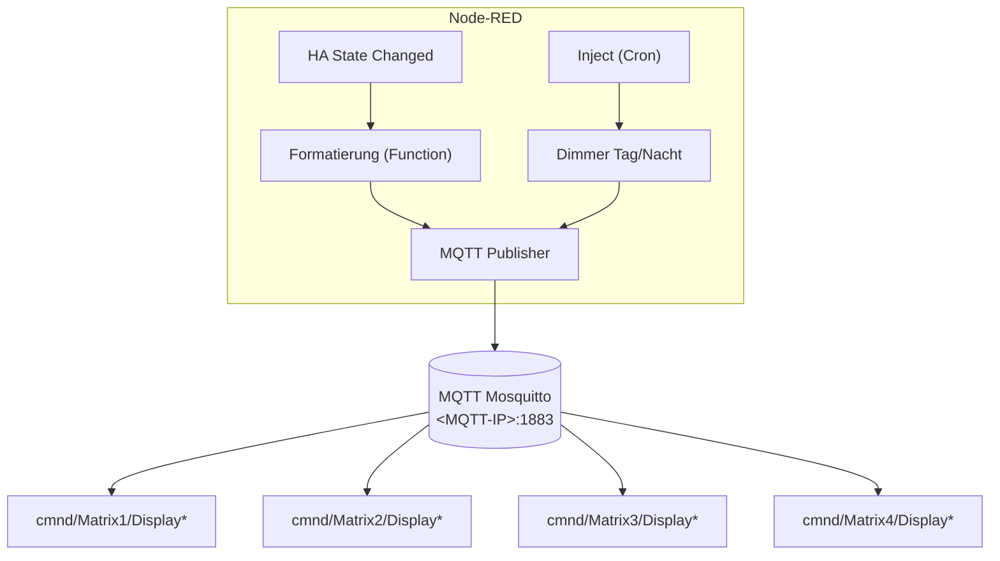
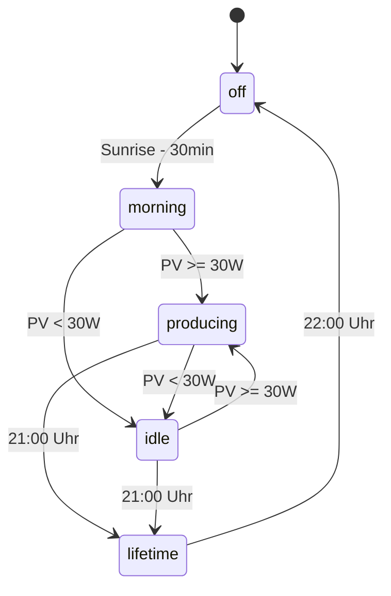
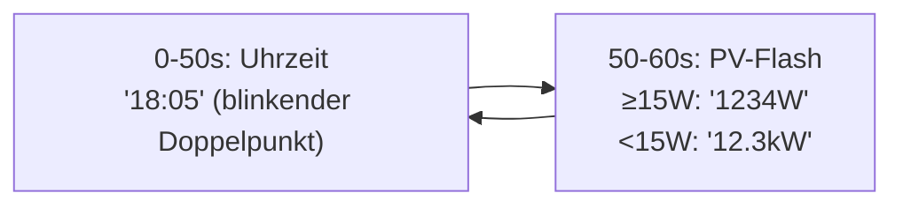
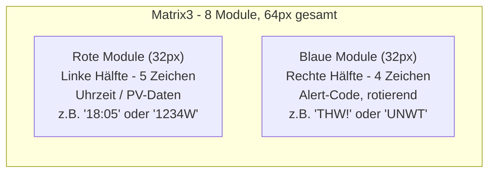
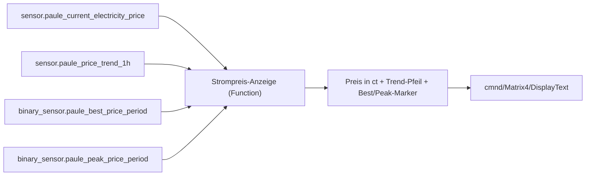
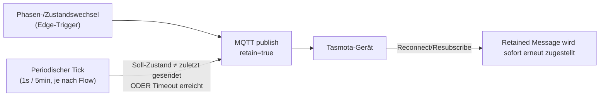

# Node-RED Konfiguration für LED-Matrix Displays (Matrix1-4)

> Für Matrix5 (HUB75/ESP32-S3, TOTP-Anzeige) siehe [matrix5-totp.md](matrix5-totp.md) — läuft komplett ohne Node-RED/Tasmota auf eigener Firmware.

## Übersicht

Jedes Matrix-Display wird über einen eigenen Node-RED Flow gesteuert.
Die Flows lesen Sensordaten aus Home Assistant und senden formatierte
Texte per MQTT an die Tasmota-Geräte.

## Architektur



## MQTT Topics

| Display | Text-Topic | Dimmer-Topic |
|---------|-----------|-------------|
| Matrix1 | `cmnd/Matrix1/DisplayText` | `cmnd/Matrix1/DisplayDimmer` |
| Matrix2 | `cmnd/Matrix2/DisplayText` | `cmnd/Matrix2/DisplayDimmer` |
| Matrix3 | `cmnd/Matrix3/DisplayText` | `cmnd/Matrix3/DisplayDimmer` |
| Matrix4 | `cmnd/Matrix4/DisplayText` | `cmnd/Matrix4/DisplayDimmer` |

> **Hinweis**: Es existiert außerdem ein separates, unabhängiges Gerät `LED-Matrix2` (ESPHome, eigenes MQTT-Schema `led-matrix2/display/time` + `led-matrix2/display/pv`). Trotz des ähnlichen Namens **kein Teil der Matrix1-4-Familie** — anderes Protokoll, andere Firmware, nicht Tasmota.

## Flow: Matrix1 (PV-Matrix, Sonnenstand-basiert)

**Tab**: `Matrix1 (PV-Matrix)`
**Display**: 4 Module (32x8), Rot, ESP-12F

### Phasen-Logik (Sonnenstand-gesteuert)



### Phasen

| Phase | Bedingung | Anzeige | Beispiel |
|-------|-----------|---------|----------|
| `off` | 22:00 - Sunrise-30min | Display aus | - |
| `morning` | Sunrise-30min, PV < 30W | Vortags-Ertrag | "4.5kW" |
| `producing` | PV ≥ 30W | Aktuelle Leistung | "350W" |
| `idle` | PV < 30W (nach Produktion) | Tagesertrag | "3.2kW" |
| `lifetime` | 21:00 - 22:00 | PV Lebensleistung | "2.79M" |

### Datenquellen (Home Assistant)

| Sensor | Verwendung |
|--------|-----------|
| `sensor.pv_leistung` | Aktuelle PV-Leistung in Watt |
| `sensor.pv_energie_heute` | Tagesertrag in kWh (Tasmota ENERGY.Today) |
| `sensor.pv_energie_gestern` | Vortags-Ertrag in kWh (Tasmota ENERGY.Yesterday) |
| `sensor.pv_energie_gesamt` | Gesamt-PV-Produktion in kWh (Tasmota ENERGY.Total) |
| `sun.sun` | Sonnenstand + next_rising/next_setting |

### Formatierung (max 5 Zeichen, kein Scrollen)

```javascript
// kWh-Anzeige (Morgen / Idle)
if (kwh < 10)    → "4.5kW"   // 5 Zeichen (. ist schmal)
if (kwh < 100)   → "12.3k"   // W weglassen
if (kwh >= 100)  → "100k"    // gerundet

// Leistung (Producing)
if (watts < 10000) → "350W"  // bis "9999W"
if (watts >= 10000) → "10kW" // Umrechnung in kW

// Lebensleistung (MWh)
if (mwh < 10)    → "2.79M"   // 2 Dezimalen
if (mwh < 100)   → "25.1M"   // 1 Dezimale
if (mwh >= 100)  → "100M"    // gerundet
```

### Helligkeit (automatisch)

| Zeitpunkt | Dimmer | Aktion |
|-----------|--------|--------|
| Display einschalten (Sunrise-30min) | 20 | Power ON |
| Sonnenuntergang | 10 | Abend-Dimm |
| 22:00 | - | Power OFF |

---

## Flow: Matrix2 (Uhr + PV)

**Tab**: `Matrix2 (Uhr + PV)`
**Display**: 4 Module (32x8), Rot

### Anzeige-Logik (60s-Zyklus)



**Gleiche Datenquellen und Formatierung wie Matrix1, nur umgekehrte Priorität.**

### Helligkeit

3-stufiges Dimmer-Schema (Node-RED-Cron, kein HA): 07-20 Uhr = 15%, 20-22 Uhr = 5%, 22-07 Uhr = 1%.

---

## Flow: Matrix3 (Uhr+PV+Alerts)

**Tab**: `Matrix3 (Uhr+PV+Alerts)`
**Display**: 8 Module (64x8), 4x Rot + 4x Blau

### Display-Layout



Kombiniert z.B. `"18:05 THW!"` oder `"1234W UNWT"`.

### Alert-System

Alerts werden alle 5 Sekunden aus Home Assistant gesammelt und nach Priorität sortiert.
Mehrere aktive Alerts rotieren alle 3 Sekunden. Jeder Alert kann per `input_boolean` in Home Assistant ein/ausgeschaltet werden.

#### Prioritäten und Quellen

```mermaid
flowchart TD
    P1["PRIO 1 - KRITISCH"] --> P1a["ALM! ← binary_sensor.divera_alarm_aktiv"]
    P1 --> P1b["NNET ← binary_sensor.fritz_box_connection = off"]
    P2["PRIO 2 - HOCH"] --> P2a["NINA ← sensor.nina_muenchen_warnungen_anzahl &gt; 0"]
    P2 --> P2b["UNWT ← sensor.dwd_muenchen_warnungen &gt; 0"]
    P2 --> P2c["HCHW ← sensor.pegel_isar_muenchen &gt; 600cm"]
    P2 --> P2d["THW! ← binary_sensor.divera_rueckmeldung_faellig"]
    P2 --> P2e["NETZ ← sensor.netzwerk_status ≠ 'Alles OK'"]
    P3["PRIO 3 - MITTEL"] --> P3a["KATZ ← sensor.petkit_status ≠ 'ok'"]
    P3 --> P3b["MESH ← sensor.mesh_letzte_nachricht &lt; 30min alt"]
    P3 --> P3c["Bxx ← sensor.mesh_x_battery &lt; 20%"]
    P3 --> P3d["WSCH ← input_boolean.waschmaschine_warten = on"]
    P3 --> P3e["TRCK ← input_boolean.trockner_warten = on"]
    P4["PRIO 4 - NIEDRIG"] --> P4a["TEUR ← sensor.tibber_price_level = VERY_EXPENSIVE"]
    P4 --> P4b["BIL! ← sensor.tibber_price_level = VERY_CHEAP"]
```



#### HA Input Booleans (Alert-Toggles)

| Entity ID | Beschreibung |
|-----------|-------------|
| `input_boolean.matrix3_thw_alarm` | THW Alarm anzeigen |
| `input_boolean.matrix3_internet_offline` | Internet-Ausfall anzeigen |
| `input_boolean.matrix3_nina_warnung` | NINA Warnungen |
| `input_boolean.matrix3_dwd_wetter` | DWD Unwetter |
| `input_boolean.matrix3_hochwasser` | Hochwasser Isar |
| `input_boolean.matrix3_thw_rueckmeldung` | THW Rückmeldung |
| `input_boolean.matrix3_netzwerk` | Netzwerk-Status |
| `input_boolean.matrix3_petkit` | Petkit Katzen-Feeder |
| `input_boolean.matrix3_meshtastic` | Meshtastic Nachrichten |
| `input_boolean.matrix3_mesh_batterie` | Mesh Batterie niedrig |
| `input_boolean.matrix3_waschmaschine` | Waschmaschine fertig |
| `input_boolean.matrix3_trockner` | Trockner fertig |
| `input_boolean.matrix3_tibber_teuer` | Tibber teuer |
| `input_boolean.matrix3_tibber_guenstig` | Tibber günstig |

Alle 14 Toggles defaulten auf `initial: true` (siehe [config/homeassistant/matrix3_notifications.yaml](../config/homeassistant/matrix3_notifications.yaml)) — alle Alert-Kategorien sind standardmäßig aktiv, einzelne lassen sich bei Bedarf über das Dashboard deaktivieren. (Zwischenzeitlich stand hier `initial: false`/alle deaktiviert; das führte am 29.07.2026 dazu, dass Matrix3 trotz laufender Node-RED-Logik keine Alerts mehr anzeigte — auf Wunsch wieder auf "alle aktiv" zurückgestellt.)

### PV-Flash-Fenster

Alle 60 Sekunden für 15 Sekunden wird die linke Hälfte auf PV-Daten umgeschaltet, sonst zeigt sie die Uhrzeit.

---

## Flow: Matrix4 (Strompreis)

**Tab**: `Matrix4 (Strompreis)`
**Display**: 4 Module (32x8), Rot, Wemos D1 Mini
**ESP-Standort**: intern, Bad!IoT/VLAN12 (DHCP)

### Anzeige-Logik



- **Preis**: aktueller Tibber-Preis in ct/kWh
- **Trend-Pfeil**: `^` (steigend) / `v` (fallend) / `-` (stabil), aus `sensor.paule_price_trend_1h`
- **Best/Peak-Marker**: markiert günstigstes bzw. teuerstes Preisfenster des Tages

> **Bug-Kette gefunden und vollständig behoben (29.07.2026), drei Ebenen tief:**
>
> 1. **Node-RED rechnete falsch**: der Flow wandte `parseFloat(payload)` auf einen Enum-Sensor
>    (`strongly_falling`…`strongly_rising`) an → immer `NaN`/0 → Pfeil zeigte unabhängig vom
>    echten Trend praktisch immer `-`. Fix: Enum-Werte auf `-2…2` gemappt.
> 2. **Die referenzierte Entity war tot**: `sensor.paule_price_trend_1h` ist ein verwaistes
>    Sensor-Objekt aus einer älteren Version der `tibber_prices`-Integration (0 Referenzen mehr
>    im aktuellen Integrations-Code) — bleibt nur noch als `restored: true`-Karteileiche in der
>    Entity-Registry. Fix: Node-RED auf `sensor.paule_current_price_trend` umgestellt (gleiches
>    5-Werte-Enum, aktiv befüllt).
> 3. **Die Integration selbst lieferte gar keine Preisdaten mehr**: `tibber_prices` fragt(e)
>    `resolution:QUARTER_HOURLY` ab — Tibber hat diese Auflösung am 17.05.2026 komplett aus dem
>    GraphQL-Schema entfernt (nur noch `HOURLY`/`DAILY`). Ein früherer Custom-Patch
>    (`QUARTER_HOURLY`→`HOURLY` in `api/client.py` + pyTibber `gql_queries.py`, plus
>    <1h-Fallback-Intervall-Matching in 3 Lookup-Funktionen, da gerundete Zeitstempel nicht mehr
>    exakt auf stündliche Grenzen treffen) wurde durch ein HACS-Update der Integration
>    stillschweigend überschrieben — seither lieferte die komplette Preis-Pipeline keine frischen
>    Daten mehr (nicht nur der Trend). Patch erneut angewendet, `__pycache__` geleert, HA neu
>    gestartet — Preisdaten fließen wieder.
>
> **Offenes Risiko**: HACS aktualisiert `tibber_prices` automatisch und überschreibt diesen Patch
> vermutlich wieder beim nächsten Release. Empfehlung: Auto-Update für diese Integration in HACS
> deaktivieren, oder den Patch als eigenen HACS-Fork/Branch pflegen, bis der Upstream-Issue
> (jpawlowski/hass.tibber_prices#141) gelöst ist.

### Helligkeit

Gleiches Tag/Nacht-Dimmer-Schema wie Matrix2/3: 22:00 Uhr abdimmen, 07:00 Uhr wieder aufhellen.

---

## Zuverlässigkeit: Retain + Self-Heal für State-Commands

**Vorfall (29.07.2026):** Matrix1 blieb eine ganze Nacht durchgehend an, obwohl die Phasen-Logik
um 22:00 Uhr zuverlässig `phase = 'off'` berechnet. Ursache: das `Power OFF`-Kommando wurde nur
**edge-triggered** beim Phasenübergang gesendet — einmalig, unretained, QoS 0. Geht genau diese
eine MQTT-Nachricht verloren (WiFi-Hänger des ESP8266, kurzer Broker-/Client-Reconnect), lernt das
Display bis zum nächsten Phasenwechsel (Sunrise-30min) nie, dass es aus sein sollte.

Das gleiche Muster (Kommando nur bei Übergang/Cron-Tick gesendet, `retain=false`) fand sich danach
auch bei der Matrix2/3/4-Dimmerstufe (Cron-Injects 07/20/22 Uhr) und — am gravierendsten, weil dort
**gar kein periodischer Tick** existierte — bei der Tibber-Strompreis-Ampel (LED-Farbe wechselt nur
bei Preis-/Perioden-Änderung, potenziell stundenlang falsch bei einer verlorenen Nachricht).

### Fix-Pattern



1. **`retain=true`** auf allen State-Commands (Power, Dimmer) — nicht auf reinen Text-Updates, die
   ohnehin sekündlich neu gesendet werden, und nicht auf zustandslosen `TOGGLE`-Befehlen (dashboard-manuelle
   Ein/Aus-Schalter), wo ein Retain bei jedem Geräte-Reconnect einen ungewollten erneuten Toggle auslösen würde.
2. **Periodisches Self-Heal** zusätzlich zum Edge-Trigger: der gewünschte Zustand wird alle 5 Minuten
   erneut publiziert, falls er sich seit dem letzten Publish nicht geändert hat. Bei Flows ohne
   eigenen Tick (Tibber-Ampel) wurde dafür ein zusätzlicher `inject`-Node ergänzt.

Betroffen und gefixt: Matrix1 (`cmnd/Matrix1/Power`), Matrix2/3/4 (`cmnd/Matrix{2,3,4}/DisplayDimmer`),
Tibber-Ampel + Ampel 2 (`cmnd/tibber-ampel{,-2}/POWER1-3`). LED-Matrix2 (ESPHome) hatte `retain=true`
bereits von Anfang an korrekt gesetzt.

### Vortag-Wert: nicht `pv_energy_daily.last_period` verwenden

Siehe auch Lesson #8 im [README](../README.md): Matrix2 und Matrix3 lasen den "Vortag"-Wert lange
Zeit aus dem `last_period`-Attribut des Utility-Meters `sensor.pv_energy_daily` statt direkt aus
`sensor.pv_energie_gestern` (Tasmota-eigener Sensor). Beide Werte liegen meist nah beieinander, aber
der Utility-Meter-Pfad ist die dokumentiert unzuverlässige Quelle — inzwischen auf allen drei
Matrix-Flows (1/2/3) einheitlich auf `sensor.pv_energie_gestern` umgestellt.

### Tote Entity-IDs im Matrix3-Alert-Sammler

Nachdem die 14 Alert-Toggles wieder aktiviert wurden (s.o.), fielen in `m3_collect_alerts` drei
falsch referenzierte Entities auf, die den jeweiligen Alert dauerhaft unbrauchbar machten — trotz
scheinbar funktionierendem Code (kein Fehler im Log, da HA bei unbekannter Entity einfach `''`
zurückgibt):

| Alert | Referenzierte (falsche) Entity | Echte Entity | Effekt des Bugs |
|-------|--------------------------------|--------------|------------------|
| HCHW (Hochwasser) | `sensor.pegel_isar_muenchen` | `sensor.pegel_isar_munchen` | Alert konnte nie auslösen, auch nicht bei echtem Hochwasser |
| KATZ (Petkit) | Vergleich `pkError !== 'no_error'` | Sensor liefert Klartext `"No error"` | **Immer** als Fehler gewertet → Dauerhaft aktiver False-Positive-Alert |
| TEUR/BIL! (Tibber) | `sensor.tibber_price_level` (existiert nicht) | `sensor.tibber_preis_status` (günstig/normal/teuer, gleiche Entity wie die Tibber-Ampel) | Alert konnte nie auslösen |

Der KATZ-Bug ist vermutlich der eigentliche Grund, warum irgendwann alle 14 Toggles auf
`initial: false` gesetzt wurden (naheliegender Workaround gegen einen Dauer-Alarm, der sich nicht
abstellen ließ, statt die Ursache zu fixen). Lesson: `getState()`/`isEnabled()`-Helper in Node-RED
geben bei falscher Entity-ID stillschweigend `''`/`false` zurück — kein Laufzeitfehler, der Bug fällt
nur beim manuellen Cross-Check jeder Entity gegen `/api/states` auf.

---

## Tasmota DisplayText Befehle

### Basis-Befehle

| Befehl | Beschreibung |
|--------|-------------|
| `DisplayText <text>` | Text anzeigen (zentriert, scrollt bei Überlänge) |
| `DisplayClear` | Display löschen |
| `DisplayDimmer 0-100` | Helligkeit (0=aus, 100=max) |
| `DisplayRotate 0\|2` | 0=Normal, 2=Upside-Down (Standard) |
| `DisplayClock 0\|1\|2` | 0=Aus, 1=12h, 2=24h Uhr |
| `DisplayScrollDelay 0-15` | Scroll-Geschwindigkeit (0=schnell) |
| `DisplayBlinkrate 0-3` | Blinkrate (0=aus) |
| `Power ON\|OFF` | Display an/aus (behält Buffer) |

### Font

Eingebauter 6x8 Pixel Font. Unterstützt ASCII 0x20-0x7F.
Mit `USE_UTF8_LATIN1`: zusätzlich Umlaute (ä, ö, ü, ß, etc.)

### Zeichenkapazität

| Module | Pixel | Zeichen (6px breit) |
|--------|-------|-------------------|
| 4x (32px) | 32 | 5 Zeichen |
| 8x (64px) | 64 | 10 Zeichen |

---

## Node-RED Import

Die Flows können aus `config/nodered/matrix_flows.json` importiert werden (enthält alle 4 Tabs Matrix1-4 + benötigte Config-Nodes):

1. Node-RED öffnen
2. Hamburger-Menü → Import
3. Datei auswählen oder JSON einfügen
4. Deploy

### Voraussetzungen

- Node `node-red-contrib-home-assistant-websocket` installiert
- MQTT-Broker konfiguriert (Mosquitto, intern erreichbar)
- Home Assistant Sensoren vorhanden (PV, Tibber, Divera, NINA, etc.)
